# CHAPTER III — REPOSITORY EVIDENCE AUDIT (TheraMotion)

Read-only forensic audit of the TheraMotion repository as primary evidence for
Chapter III (Methodology) of the BS Computer Science thesis.

| | |
|---|---|
| **Repository** | `/home/miku/Coding-projects/thesis_system-for-now-` |
| **Branch audited** | `production` @ `b35e4a1` ("adjust margin of session summary screen") |
| **Working tree** | Dirty — 5 modified files, 2 untracked (frontend UI/splash only; no backend/ML changes) |
| **Audit date** | 2026-08-25 |
| **Method** | Static reading of code, configuration, model checkpoints, SQL, and full git history. No code modified. |

## Execution environment caveat (READ FIRST)

**Backend Python dependencies are NOT installed in this environment.** Verified:

```
$ python3 -c "import fastapi"    -> ModuleNotFoundError: No module named 'fastapi'
$ python3 -c "import torch"      -> ModuleNotFoundError: No module named 'torch'
$ python3 -c "import mediapipe"  -> ModuleNotFoundError: No module named 'mediapipe'
$ python3 -c "import cv2"        -> ModuleNotFoundError: No module named 'cv2'
$ python3 -c "import sklearn"    -> ModuleNotFoundError: No module named 'sklearn'
$ ls backend/.venv/lib/python3.12/site-packages/
dotenv  pip  pip-24.0.dist-info  python_dotenv-1.0.1.dist-info
```

`backend/.venv` contains only `pip` and `python-dotenv` — none of the 17 packages in
`backend/requirements.txt`. Consequences for this audit:

- **Nothing was executed.** No API was started, no model was loaded through PyTorch, no
  MediaPipe inference was run, no latency was measured.
- Every model/architecture claim below was verified by **parsing the shipped `.pth`
  checkpoints directly** (pure-Python zip + pickle walk, no `torch`) and by reading the
  version-controlled `*_metrics.json` run records. This is *stronger* evidence than a
  runtime check for architecture, but it cannot verify runtime behaviour.
- Every dataset claim below was recovered from **Git LFS objects present in
  `.git/lfs` (735 MB)** plus git history, and video properties were parsed with a
  purpose-written MP4/MOV atom reader — `ffprobe` and `cv2` are both unavailable.
- Anything marked **MEASUREMENT REQUIRED FOR CHAPTER IV** cannot be closed until
  `pip install -r backend/requirements.txt` is run on the RTX 5060 Ti machine.

## Evidence-strength legend

| Tag | Meaning |
|---|---|
| **IMPLEMENTED** | Code exists, is reachable from production routing, and its behaviour is determinable by reading it |
| **IMPLEMENTED BUT NOT TESTED/PROVEN** | Code exists and is reachable, but no test, benchmark, or recorded measurement demonstrates it works |
| **DOCUMENTED ONLY** | Asserted in `README.md` / `CLAUDE.md` / code comments, with no implementing code or artifact |
| **NOT FOUND** | No trace in working tree or git history |
| **CONTRADICTED BY CODE** | The manuscript/docs claim is refuted by what the code actually does |
| **NOT VERIFIED FROM REPOSITORY** | Determinable only from information outside the repo |

---

# PART 1 — ACTUAL SYSTEM ARCHITECTURE (END-TO-END TRACE)

## 1.1 Component register

Every row traced from the mobile entry point through to persistence. "Reached in
production?" means: is there a live call path from the shipped React Native app.

### Mobile app → authentication

| Field | Value |
|---|---|
| File | `frontend/src/services/supabase.js:29-40`, `frontend/src/store/useAuthStore.js` |
| Function/Class | `createClient(...)` with `ExpoSecureStoreAdapter`; `useAuthStore` |
| Input | email + password (`LoginScreen`/`SignupScreen`) |
| Output | Supabase session `{ access_token (ES256 JWT), user.id }` |
| Dependencies | `@supabase/supabase-js ^2.105.3`, `expo-secure-store ~15.0.8` |
| Protocol | HTTPS direct to Supabase GoTrue (does **not** traverse the FastAPI backend) |
| Computation | Supabase cloud; token stored on-device in iOS Keychain / Android Keystore via `SecureStore` |
| Reached in production? | **YES** |

Forgot-password path additionally calls the backend: `useAuthStore.js:171` →
`POST /auth/check-email` (`backend/routers/auth.py:13-22`) — the only public backend route
besides `/health`.

### Onboarding → patient profile creation

| Field | Value |
|---|---|
| File | `frontend/src/hooks/useOnboarding.js:108`; `backend/routers/patients.py:16-55` |
| Function | `useOnboarding` (4-step machine) → `create_patient_profile` |
| Input | `{first_name, last_name, months_in_recovery:int, affected_area, affected_side, id}` (`backend/schemas/patient.py`) |
| Output | `{patient_id, patient_profile, database}` |
| Dependencies | `core.auth.verify_jwt`, `core.auth.assert_patient_match`, `core.supabase_db.save_patient_profile` |
| Protocol | `POST /patients` over HTTPS (Cloudflare Tunnel) |
| Computation | Backend validation; row written to Supabase Postgres `public.patients` |
| Reached in production? | **YES** |

`stroke_type` is **hardcoded** to `"ischemic"` at `routers/patients.py:30`; it is never
collected from the patient. `core/recommender.py:16-17` `_encode_stroke_type()` returns a
constant `0` with the comment "All strokes are ischemic".

### Camera capture loop

| Field | Value |
|---|---|
| File | `frontend/src/hooks/useCamera.js:204-252` (`captureAndSend`) |
| Input | `expo-camera` front-camera frames, `takePictureAsync({quality: 0.1, base64: true, skipProcessing: true})` |
| Output | base64 JPEG → `Uint8Array` → WebSocket binary frame (`usePoseDetection.js:282-310`) |
| Flow control | One frame in flight at a time (`inFlightRef`), 2000 ms watchdog, 200 ms retry on `not_open`, paused during BreakScreen |
| Computation | Device |
| Reached in production? | **YES** |

Effective frame rate is **self-clocking**, not fixed: the next capture is issued only when
the previous pose result returns (`usePoseResultHandler.js:404-407`). Code comments state
"8-15 FPS" (`useCamera.js:122`) and `core/session_video.py:69` states "only ~1-3 fps over the
tunnel" — these two figures disagree and **neither is backed by a recorded measurement**.

### Transport

| Path | Endpoint | Auth | Reached? |
|---|---|---|---|
| Realtime pose | `WS /ws/pose` (`backend/routers/pose.py:147`) | First-message JSON `{type:"auth", token}` | **YES** |
| Legacy single-frame pose | `POST /pose/estimate` (`backend/routers/pose.py:56`) | `Depends(verify_jwt)` header | **NO — dead from the app** |
| End-of-exercise classification | `POST /predict/form` (`backend/routers/predictions.py:20`) | header JWT + `assert_patient_match` | **YES** (`usePoseDetection.js:344`) |
| Video-file classification | `POST /predict/form-from-video` (`predictions.py:68`) | header JWT + `assert_patient_match` | **NO — no frontend caller** |
| Recommendation | `GET /recommendation/{patient_id}` (`routers/recommendations.py:13`) | header JWT + `assert_patient_match` | **YES** (`usePatientStore.js:77`) |
| Session save | `POST /sessions` (`routers/sessions.py:111`) | header JWT + `assert_patient_match` | **YES** (`useSessionStore.js:191`) |
| Patient create | `POST /patients` | header JWT + `assert_patient_match` | **YES** |
| Email pre-check | `POST /auth/check-email` | **public**, 5/min | **YES** |
| Health | `GET /health` (`main_api.py:67`) | **public** | not called by app |

Exhaustive grep of `frontend/src` for backend calls returns exactly six call sites:
`/predict/form`, `/sessions`, `/auth/check-email`, `/patients`, `/recommendation/{id}`, and
the `/ws/pose` socket. **`POST /pose/estimate` and `POST /predict/form-from-video` are
maintained but unreachable from the shipped client** — relevant if the manuscript describes
a dual REST/WS pose architecture as being in active use.

### Pose estimation

| Field | Value |
|---|---|
| File | `backend/core/mediapipe_vision.py` |
| Functions | `create_realtime_pose()` (:12), `_create_single_frame_pose()` (:37), `estimate_pose_from_image_bytes()` (:53), `extract_sequence_from_video()` (:187) |
| Model | MediaPipe BlazePose, 33 landmarks (`mediapipe==0.10.21`) |
| **Live config** | `static_image_mode=False`, **`model_complexity=0` (Lite)**, `smooth_landmarks=True`, `min_detection_confidence=0.5`, `min_tracking_confidence=0.5` |
| **Training-extraction config** | `static_image_mode=False`, **`model_complexity=1` (Full)**, same confidences (`mediapipe_vision.py:170-176`, `:212-217`) |
| Input | JPEG bytes → `cv2.imdecode` → **`cv2.flip(frame, 1)` (horizontal mirror)** → RGB |
| Output (live) | `[{x: lm.x*w, y: lm.y*h, z: lm.z*w, score: lm.visibility} × 33]` — **PIXEL coordinates** |
| Output (training) | `[lm.x, lm.y, lm.z] × 33` flattened — **NORMALIZED [0,1] coordinates** (`extract_pose_keypoints_from_frame`, :181-184) |
| Isolation | One `Pose` instance per WebSocket connection + a `threading.Lock` (MediaPipe is not thread-safe); run via `asyncio.to_thread` |
| Computation | **Backend** (server CPU) — pose estimation is *not* on-device |
| Reached in production? | **YES** |

**Two train/inference asymmetries are visible in this file and are load-bearing for
Chapter III/IV honesty. See §2.5 and Part 12.**

### Exercise routing / form scoring

| Field | Value |
|---|---|
| File | `backend/services/pose_service.py:400-647` (`score_pose`) |
| Input | `keypoints`, `exercise_type` (a concatenated *hint string*, see below), `affected_side` |
| Output | `{score: 0-100, angles: {}, colors: {}, hint: str, hint_key: str}` |
| Routing mechanism | **Substring matching on a joined hint string**, not an enum |
| Computation | Backend, per frame |
| Reached in production? | **YES** |

The `exercise_type` the WS receives is built client-side at `useCamera.js:141-148` as
`[exercise_type, name, body_area, focus].join(' ').toLowerCase()`. `score_pose` then
routes by `in` tests: `is_shoulder_flexion` (:413), `is_hand_to_mouth` (:417),
`is_knee_extension` (:424), plus generic `is_arm`/`is_leg` keyword lists (:403-408).
A separate clean slug (`exercise_slug`) is sent for the evidence-clip filename only.

Side mapping (`pose_service.py:446-452`): because the frame is mirrored, clinical
**left → MediaPipe "R"** landmarks and clinical **right → MediaPipe "L"**. Any unrecognised
value defaults to right.

Visibility gate (`:464-481`): arm-only → landmarks `(0,11,12,13,14,15,16)`; leg-only →
`(11,12,23,24,25,26,27,28)`; otherwise all 33. Mean landmark confidence **< 50 ⇒ score 0**
and an early return with a "step back" hint.

### LSTM inference

| Field | Value |
|---|---|
| File | `backend/core/neural_network.py` |
| Function | `classify_form_sequence(exercise_type, sequence)` (:301) |
| Input | list of `{frame_index, keypoints: [99 floats]}` supplied **by the mobile client** |
| Output | `{label, confidence, frame_count, exercise_type, device, model_source, geometric_veto}` |
| Preprocessing | `_normalize_keypoints_to_hip_center` (:316) → length check (:318) → `_prepare_input_tensor` resample/pad to 40 (:172) |
| Model resolution | `_load_model_for` (:218): `models/lstm_<slug>.pth` → `models/lstm_weights.pth` → rule-based |
| Computation | Backend, CUDA if available, `torch.inference_mode()` + autocast (bf16/fp16) |
| Reached in production? | **YES**, once per finished exercise (`usePoseResultHandler.js:160`) |

Warm-up at startup: `main_api.py:37-38` runs `warmup_model()` on a daemon thread inside
`lifespan`.

### Rep counting

| Implementation | File | Used in production? |
|---|---|---|
| **Client generic** `RepCounter` | `frontend/src/utils/repCounter.js:16-102` | **YES** — `useCamera.js:109,306`, driven per frame at `usePoseResultHandler.js:313` |
| **Client shoulder-flexion** `ShoulderFlexionGuide` | `frontend/src/utils/shoulderFlexionGuide.js:30-182` | **YES** — replaces `RepCounter` for shoulder flexion (`usePoseResultHandler.js:260-293`) |
| **Backend** `RepCounter` | `backend/services/pose_service.py:660-759` | **NO — DEAD CODE** |

Grep across `backend/` for `RepCounter` returns exactly two hits, both inside its own class
body/docstring (`pose_service.py:660`, `:681`). Its own docstring says *"Wired in Phase C —
for now this class lives on its own"* (:655-658). **Rep counting is 100% client-side.** The
backend class is an unreferenced mirror.

### Feedback generation

| Channel | File | Mechanism | Production? |
|---|---|---|---|
| Numeric form score | `pose_service.py:29-51` `color_and_score` | continuous piecewise map: green 100→90, yellow 90→50, red 50→0 | **YES** |
| Skeleton band colours | `pose_service.py` `colors{}` | `#4CAF50` / `#FFC107` / `#F44336` | **YES** — `SkeletonOverlay.js` |
| Text coaching | `pose_service.py:72-125` `HINT_TEXT` (36 keys) | stable `hint_key` → prose, resolved server-side, key also sent to client | **YES** |
| Rep-aware text override | `repCounter.js:105-120` `repAwareHint` | client overrides backend wording after a counted rep | **YES** |
| **Voice** | `frontend/src/hooks/useVoicePlayback.js` | pre-generated clips fetched from public Supabase bucket `exercise-audio/voice/manifest.json`, edge-triggered on `hint_key`, 2500 ms cooldown | **YES (code path)** — but see below |

Voice clips are produced **offline** by `backend/scripts/generate_voice.py` (VoxCPM TTS,
`--upload` to Storage). `backend/assets/voice/` is **gitignored** and absent, and no
`manifest.json` exists in the repo. `useVoicePlayback.js:75` degrades to text-only when the
manifest fetch fails. So: voice feedback is **IMPLEMENTED but its audio assets are not
verifiable from the repository** — whether it is live depends on the Storage bucket.

### Session completion → persistence

`useCamera.finishExercise` → `useSessionStore.saveCurrentScore` (buffers per-exercise
results in Zustand) → on session end, one batched `POST /sessions`
(`useSessionStore.js:191`) → `routers/sessions.py:save_session`:

1. `assert_patient_match(claims, patient_id)` (:136)
2. `get_patient_by_id` → 404 if absent (:141-143)
3. `_normalize_set_results` (:13-108) — closed schema, `format ∈ {reps, hold}`, score clamped
   to `[0,100]`, **deduped by `set_index`, last-write-wins**
4. Idempotency: `recommendation_log_exists(patient_id, session_id, session_index)` (:250)
5. `save_recommendation_log` → one row per exercise in `public.recommendation_logs`, with
   the whole session payload in the `recommendation` JSONB

Per-row failures are collected into `failed_rows` and returned as `status: "partial"` — a
partial write does not fail the request.

### Session evidence video (side effect of `/ws/pose`)

`backend/core/session_video.py`. `SessionClipRecorder` buffers raw JPEGs; window closes at
**`_MAX_CLIP_SECONDS = 10.0` or `_MAX_CLIP_FRAMES = 200`**, whichever first (:59-60, :111).
Encoded to H.264/yuv420p at the **real measured capture rate** (`capture_fps()`, clamped
1.0–30.0, fallback 6.0), downscaled to ≤480p, CRF 28, preset veryfast (:195-203). Uploaded
to the private `session-evidence` bucket with `x-upsert`, indexed into `public.session_videos`,
then `_purge_other_sessions` deletes the patient's older clips. Runs on a daemon thread
(`store_clip_async`, :319-322) and swallows all exceptions (:297-298).

`patient_id` comes from the **verified JWT `sub`**, never the client's `patient_id` field —
`routers/pose.py:265` with an explicit comment at :262-264.

### Recommendation engine

`GET /recommendation/{patient_id}` → `recommend_session_v2` (`core/recommender.py:374`).
Full trace in **Part 7**.

### Therapist / progress functionality

| Feature | Evidence | Status |
|---|---|---|
| **Patient-facing** progress | `useOverallProgress.js`, `useWeeklyScores.js`, `usePreviousScores.js`, `WeeklyScoreChart.js`, `OverallProgressCard.js`, `HistoryList.js`, `PatientProfileScreen.js` — all read `recommendation_logs` **scoped to `user.id`** via the Supabase anon client | **IMPLEMENTED** |
| **Therapist-facing** review app/screen | none — no login role, no therapist screen, no route, no `therapists` table | **NOT FOUND** |
| Therapist DB scaffolding | `db/rls_policies.sql:110-152` defines `home_visits` (`therapist_id = auth.uid()`) and `clinical_notes` (single hardcoded UUID `8d54c763-…`); `patients_select` grants read-all to hardcoded email `admin@email.com` (:60) | **DB policies only — no application code touches these tables** |
| Evidence-video viewer | `db/session_videos.sql` comments say "the PT dashboard queries" it; no such dashboard exists in this repo | **DOCUMENTED ONLY** |

Grep across `backend/` + `frontend/src` for `therapist|clinician|role` returns only
comments, RLS policy text, and `SUPABASE_SERVICE_ROLE_KEY`. **There is no therapist-facing
application.** Two `TODO`s in `rls_policies.sql` (:52-55, :143-145) flag the hardcoded
admin identity as unresolved.

## 1.2 Mermaid architecture diagram (as-implemented)

```mermaid
flowchart TB
  subgraph DEV["Mobile device — React Native / Expo SDK 54"]
    LOGIN["LoginScreen / SignupScreen<br/>useAuthStore"]
    SEC[("expo-secure-store<br/>JWT at rest")]
    ONB["OnboardingScreen<br/>useOnboarding"]
    HOME["HomeScreen<br/>usePatientStore"]
    EX["ExerciseScreen<br/>useCamera"]
    CAM["expo-camera<br/>takePictureAsync q=0.1"]
    WSH["usePoseDetection<br/>WS client + heartbeat 25s"]
    PRH["usePoseResultHandler<br/>per-frame state"]
    RC["repCounter.js RepCounter<br/>ShoulderFlexionGuide"]
    VOI["useVoicePlayback<br/>expo-audio"]
    BUF["keypointsBufferRef<br/>PIXEL coords accumulated"]
    SUM["SessionSummaryScreen<br/>useSessionStore"]
    PROF["PatientProfileScreen<br/>useOverallProgress"]
  end

  subgraph CF["Cloudflare Tunnel — api.necookie.dev"]
    TUN(["HTTPS / WSS"])
  end

  subgraph API["FastAPI backend — main_api.py"]
    RL["slowapi limiter<br/>200/min floor, CF-Connecting-IP"]
    AUTH["core/auth.py<br/>ES256 + JWKS (throttled)"]
    WS["routers/pose.py<br/>WS /ws/pose — cap 8"]
    PEST["routers/pose.py<br/>POST /pose/estimate"]
    PRED["routers/predictions.py<br/>POST /predict/form"]
    PFV["routers/predictions.py<br/>POST /predict/form-from-video"]
    REC["routers/recommendations.py<br/>GET /recommendation/{id}"]
    SESS["routers/sessions.py<br/>POST /sessions"]
    PAT["routers/patients.py<br/>POST /patients"]
    ACH["routers/auth.py<br/>POST /auth/check-email"]
  end

  subgraph CORE["core/ + services/ — domain logic"]
    MP["mediapipe_vision.py<br/>BlazePose complexity=0<br/>cv2.flip + PIXEL coords"]
    PS["services/pose_service.py<br/>angles, bands, H2M gate, HINT_TEXT"]
    NN["neural_network.py<br/>StrokeLSTMClassifier<br/>+ knee geometric veto"]
    SV["session_video.py<br/>clip buffer + H.264 encode"]
    TRJ["trajectory.py<br/>slope / signals / state"]
    RECO["recommender.py<br/>recommend_session_v2"]
    CAT["exercise_catalog.py<br/>DIFFICULTY_OVERLAY + 2-and-1 mixing"]
  end

  subgraph MODELS["backend/models/ — version-controlled"]
    M1[["lstm_shoulder_flexion.pth<br/>readout=last"]]
    M2[["lstm_hand_to_mouth.pth<br/>readout=last"]]
    M3[["lstm_sit_to_stand.pth<br/>readout=last"]]
    M4[["lstm_knee_extension.pth<br/>readout=MAXPOOL"]]
    MX["lstm_weights.pth — ABSENT<br/>rf_recommender.pkl — ABSENT"]
  end

  subgraph SB["Supabase — Postgres + Auth + Storage"]
    GOTRUE["GoTrue Auth (ES256)"]
    JWKS["/auth/v1/.well-known/jwks.json"]
    T1[("patients")]
    T2[("recommendation_logs")]
    T3[("form_predictions")]
    T4[("exercises")]
    T5[("session_videos")]
    B1[["bucket session-evidence — private"]]
    B2[["bucket exercise-audio — public"]]
    B3[["bucket exercise-demos"]]
  end

  LOGIN <--> GOTRUE
  LOGIN --> SEC
  ONB -->|POST /patients| TUN
  HOME -->|GET /recommendation| TUN
  EX --> CAM --> WSH
  WSH -->|"binary JPEG"| TUN
  TUN --> RL --> WS
  WS --> AUTH -.->|JWKS fetch| JWKS
  WS --> MP --> PS
  PS -->|"score, colors, angles, hint_key"| WS --> TUN --> PRH
  PRH --> RC
  PRH --> VOI
  VOI -. "manifest.json + clips" .-> B2
  PRH --> BUF
  WS --> SV --> B1
  SV --> T5
  BUF -->|"POST /predict/form (99 floats/frame)"| TUN --> PRED --> NN
  NN --> MODELS
  PRED --> T3
  PFV -.->|"no frontend caller"| NN
  PEST -.->|"no frontend caller"| MP
  TUN --> REC --> RECO
  RECO --> TRJ
  RECO --> CAT --> T4
  TRJ --> T2
  TUN --> SESS --> T2
  TUN --> PAT --> T1
  TUN --> ACH --> GOTRUE
  SUM --> T2
  PROF --> T1
  PROF --> T2

  classDef dead stroke-dasharray: 5 5,stroke:#c33,color:#c33
  classDef missing stroke:#c33,stroke-width:2px,color:#c33
  class PEST,PFV dead
  class MX missing
```



Dashed red = implemented but unreachable from the shipped client. Red outline = artifact
referenced by code/docs but absent from the repository.

## 1.3 Backend layering compliance

`CLAUDE.md` asserts a strict `routers/` (thin) → `core/` (no FastAPI) → `services/` split.
Verified by reading all 22 backend modules:

- `core/` modules import no FastAPI symbols — **holds**.
- `routers/` are thin except `routers/sessions.py:13-108`, where `_normalize_set_results`
  (96 lines of validation/normalisation/dedupe logic) lives in the router rather than in
  `core/` or `services/`. Minor deviation; note it if Chapter III claims the separation is
  absolute.

---

# PART 2 — EXERCISE PIPELINE AUDIT

## 2.0 Direct checkpoint inspection (primary evidence)

`torch` is unavailable, so all four `.pth` files were opened as ZIP archives and their
pickled `state_dict` walked with a stub unpickler. **All four are byte-for-byte identical in
architecture:**

```
lstm.weight_ih_l0   (512, 99)     lstm.weight_hh_l0   (512, 128)
lstm.bias_ih_l0     (512,)        lstm.bias_hh_l0     (512,)
lstm.weight_ih_l1   (512, 128)    lstm.weight_hh_l1   (512, 128)
lstm.bias_ih_l1     (512,)        lstm.bias_hh_l1     (512,)
head.0.weight       (64, 128)     head.0.bias         (64,)
head.2.weight       (2, 64)       head.2.bias         (2,)
_metadata: {'': v1, 'lstm': v1, 'head': v1, 'head.0': v1, 'head.1': v1, 'head.2': v1}
-> 12 tensors + metadata, 257,730 parameters each
```

Derived facts, independent of any documentation:

- `weight_ih_l0` is `(512, 99)` ⇒ **input_size = 99**, and `512 = 4 × 128` ⇒ **hidden_size = 128**
- Layers `l0` and `l1` only, and **no `_reverse` suffixed keys** ⇒ **num_layers = 2, UNIDIRECTIONAL**
- `head.0` `(64,128)` then `head.2` `(2,64)`, with `head.1` present in `_metadata` but
  carrying no parameters ⇒ head is `Linear(128,64) → ReLU → Linear(64,2)` ⇒ **2-class output**
- **`readout` is NOT stored in the checkpoint.** It is a plain Python attribute
  (`neural_network.py:47`) that adds no parameters. A checkpoint therefore loads cleanly under
  either readout, and a mismatch is silent — exactly what the code comment at
  `neural_network.py:44-46` warns about. **Max-pool for knee_extension can only be verified
  from code + the metrics JSON, never from the checkpoint.**

Checkpoint file provenance (git):

| File | Committed in | Date |
|---|---|---|
| `lstm_shoulder_flexion.pth` | `dff8f50` | 2026-08-11 |
| `lstm_hand_to_mouth.pth` | `dff8f50` | 2026-08-11 |
| `lstm_knee_extension.pth` | `dff8f50` | 2026-08-11 |
| `lstm_sit_to_stand.pth` | `835b5ab` | 2026-08-11 |

## 2.1 Shoulder flexion

| # | Item | Evidence |
|---|---|---|
| A | Checkpoint | `backend/models/lstm_shoulder_flexion.pth` (1,034,547 B) |
| B | Loading code | `neural_network.py:218-256` `_load_model_for("shoulder_flexion")` → `_load_checkpoint(MODELS_DIR/"lstm_shoulder_flexion.pth", readout="last")`, `load_state_dict(..., strict=True)` (:209) |
| C | Model class | `StrokeLSTMClassifier` (`neural_network.py:22-52`), duplicated verbatim in `scripts/train_model.py:117-142` |
| D | Input dims | 99 (`KEYPOINT_DIM`, :14) — verified from checkpoint |
| E | Sequence length | 40 (`DEFAULT_SEQUENCE_LEN`, :16); minimum 20 frames (`MIN_SEQUENCE_FRAMES`, :15) |
| F | Preprocessing | `_normalize_keypoints_to_hip_center` (:316) → `_prepare_input_tensor` (:172): >40 frames uniformly resampled `round(i*step)`; <40 **left-zero-padded**; ==40 unchanged |
| G | Normalization | Hip-midpoint translation only (`mediapipe_vision.py:111-153`): subtract `(lm23+lm24)/2` from all 33 landmarks. **No scale normalisation, no standardisation** |
| H | LSTM layers | 2 |
| I | Hidden size | 128 |
| J | Direction | Unidirectional |
| K | Dropout | 0.2, inside `nn.LSTM(dropout=0.2)` — i.e. **between the 2 LSTM layers only**; the head has no dropout |
| L | Classifier head | `Linear(128,64) → ReLU → Linear(64,2)` |
| M | **Readout** | **last timestep** — `outputs[:, -1, :]` (:51); slug not in `POOLED_READOUT_SLUGS` |
| N | Label mapping | index `1 = "correct"`, `0 = "incorrect"` (`neural_network.py:350`; training `LABEL_ALIASES` `train_model.py:80-87`) |
| O | Confidence | `softmax(logits)` then `max` over the 2 classes, rounded to 4 dp (:347-351). **Confidence of the predicted class, not P(correct)** |
| P | Exercise-specific logic | **Two-checkpoint guide, CLIENT-SIDE ONLY**: `frontend/src/utils/shoulderFlexionGuide.js`. Phases `need_start → ready → raising → holding`. Thresholds: `ELBOW_START_MAX=80`, `ELBOW_BENT_MAX=110`, `ELBOW_STRAIGHT_MIN=150`, `SHOULDER_TOP_MIN=140`, `SHOULDER_YELLOW_MIN=120`, `SHOULDER_LEAVE_READY=60` (:23-28). Backend supplies both `angles.bicepCurl` (hip-shoulder-elbow) and `angles.elbowAngle` (shoulder-elbow-wrist) at `pose_service.py:532-546`. Backend band: target 160°, green ±20, yellow ±40 (:533); backend fallback hint has an extra `angle < 40 → get_ready` branch (:159-160) |
| Q | Rep counting | `ShoulderFlexionGuide.update()` **replaces** the generic `RepCounter` (`usePoseResultHandler.js:261-293`). Rep credited on reaching straight-overhead (holdMs=0) or after sustaining it |
| R | Feedback | 9 `shoulder_flexion.*` keys in `HINT_TEXT` (`pose_service.py:88-96`); guide emits its own `hintKey` + `feedbackText` + colour override (`shoulderFlexionGuide.js:126-181`) |
| S | Fallback | No checkpoint ⇒ global `lstm_weights.pth` ⇒ **absent** ⇒ `{label:"incorrect", confidence:0.55, model_source:"rule_based"}` (:331-339). Also returned when `len(sequence) < 20` (:318-326) |
| T | `model_source` | `"lstm_shoulder_flexion"` |

**Held-out test (`lstm_shoulder_flexion_metrics.json`, 2026-08-10T19:55:18):**
accuracy **100.0%**, precision 1.0, recall 1.0, F1 1.0, TP 4 / TN 6 / FP 0 / FN 0, **n = 10**.
Train 82 (32 correct / 50 incorrect), val 9 (4/5), best val loss 0.0001 at epoch 40/40.

> ⚠️ **Contradiction:** `core/exercise_catalog.py:78` and `CLAUDE.md` both state
> *"shoulder_flexion 73%"*. The shipped metrics file says **100%** on n=10 after the
> 2026-08-10 retrain. Do not quote 73%. Also note train loss 0.0001 / val loss 0.0001 /
> 100% test on n=10 is a **saturated fit on a tiny split**, not a robust accuracy estimate.

## 2.2 Hand to mouth

Rows A–O, S identical in form to §2.1 with slug `hand_to_mouth`; checkpoint
`lstm_hand_to_mouth.pth` (1,034,514 B), readout **last**, `model_source = "lstm_hand_to_mouth"`.

| # | Item | Evidence |
|---|---|---|
| P | **Exercise-specific gate** | **Two-stage, BACKEND**: (1) elbow band, `_H2M_TARGET_ANGLE = 9.5`, `_H2M_GREEN_BAND = 9.5` (green 0–19°), `_H2M_YELLOW_BAND = 20.0` (yellow 20–29°, red 30+) — `pose_service.py:188-190`. (2) **3-bound nose-anchored spatial gate** `hand_in_mouth_zone_detail` (:312-392) |
| | Gate bound 1 | `ratio = ‖wrist − mouth_center‖ / shoulder_width ≤ _H2M_WRIST_MOUTH_MAX_RATIO = 0.55` |
| | Gate bound 2 | `vs_nose ≤ −_H2M_WRIST_MIN_BELOW_NOSE (0.03)` — rejects a fist at/above nose level |
| | Gate bound 3 | `vs_nose ≥ −_H2M_WRIST_MAX_BELOW_NOSE (0.59)` — rejects a wrist parked at collarbone/chest |
| | Gate confidence preconditions | nose ≥ 0.5, min(mouth_L, mouth_R) ≥ 0.5, min(shoulder_L, shoulder_R) ≥ 0.3, shoulder_width ≥ 1e-3, wrist ≥ 0.3 |
| | Gate verdicts | `True` → elbow score stands; `False` → `score = min(score, 10)`, colour red, `hint_key = hand_to_mouth.off_target`; `None` (unverifiable) → `score = min(score, 55)`, colour yellow, `hand_to_mouth.unverified` — **never green on unverified data** (:571-578) |
| Q | Rep counting | Generic client `RepCounter` on `colors.bicepCurl` |
| R | Feedback | 8 `hand_to_mouth.*` keys (`pose_service.py:98-109`) |
| T | Debug evidence | `H2M_GATE_DEBUG=1` env var logs verdict, reason, per-landmark confidences, per-wrist `ratio/above/vs_nose/near/under/in_band/pass` (:8-10, :564-570) |

**Held-out test (`lstm_hand_to_mouth_metrics.json`, 2026-07-30T20:58:58):**
accuracy **71.43%**, precision 0.7143, recall 0.7143, F1 0.7143, TP 5 / TN 5 / FP 2 / FN 2,
**n = 14**. Train 134 (68/66), val 14 (7/7), best val loss 0.4376 at epoch 9, stopped at 12/25.

Calibration provenance: the comment at `pose_service.py:170-190` states the band was
measured over "all 48 correct-labelled clips" on "633 frames" the gate verified, giving
`p5=1 p25=5 p50=11 p75=16 p90=20 p99=27`. **The clips, the measurement script, and the
frame-level distribution are NOT in the repository** — this is a comment, not an artifact.
Same for the field-measured spatial thresholds at :269-309. **NOT VERIFIED FROM REPOSITORY.**

## 2.3 Sit to stand

Rows A–O, S as above; checkpoint `lstm_sit_to_stand.pth` (1,034,503 B), readout **last**,
`model_source = "lstm_sit_to_stand"`.

| # | Item | Evidence |
|---|---|---|
| P | Exercise-specific logic | **NONE — no gate, no veto, no guide.** Routed by the generic leg branch: `pose_service.py:601-609`, target **90°**, green ±15, yellow ±30 |
| Q | Rep counting | Generic client `RepCounter` on `colors.kneeFlexion` |
| R | Feedback | 6 `sit_to_stand.*` keys (`pose_service.py:110-116`), emitted by `leg_hint` (:213-224). Note `leg_hint` doubles as the **cross-body leg fallback** |
| T | `model_source` | `"lstm_sit_to_stand"` |

**Held-out test (`lstm_sit_to_stand_metrics.json`, 2026-08-11T21:12:04):**
accuracy **86.67%**, precision 0.8182, recall 1.0, F1 0.9, TP 9 / TN 4 / FP 2 / FN 0,
**n = 15**. Train 176 (110 correct / 66 incorrect), val 24 (15/9), seed 42, readout `last`,
best val loss 0.3672 at epoch 6, stopped at 9/25.

> 🔴 **This test score is contaminated.** See Part 5 — 3 of the 15 sit-to-stand test clips
> are **byte-identical** to clips in train/val, and 8 of 24 val clips are duplicates of
> train/test clips. Its reported 86.67% is not a clean held-out estimate.

`exercise_catalog.py:79-82` also records that the previously-quoted *"87% global fallback"*
figure for sit_to_stand was **unbacked** (the real global test was 66.04%, see
`training_metrics.json`). Do not quote 87%.

## 2.4 Knee extension — the two claims under scrutiny

### ✅ Geometric veto — **VERIFIED**

**`backend/core/neural_network.py:121-169` and `:354-364`.** Exact code:

```python
# neural_network.py:130-132
_KNEE_EXTENSION_ANGLE = 165.0    # near-full knee extension (hip-knee-ankle)
_KNEE_MIN_EXTENDED_FRAMES = 3    # sustained, not a one-frame spike
_KNEE_LEGS = {"L": (23, 25, 27), "R": (24, 26, 28)}  # (hip, knee, ankle) indices

# neural_network.py:149-169
def _knee_reaches_extension(sequence) -> bool:
    streaks = {"L": 0, "R": 0}
    longest = {"L": 0, "R": 0}
    for frame in sequence:
        kp = _extract_keypoints(frame)
        if not any(kp):                       # skip padded/no-pose frames
            continue
        for side, (hip, knee, ank) in _KNEE_LEGS.items():
            angle = _knee_angle_xy(kp, hip, knee, ank)
            if angle is not None and angle >= _KNEE_EXTENSION_ANGLE:
                streaks[side] += 1
                longest[side] = max(longest[side], streaks[side])
            else:
                streaks[side] = 0
    return max(longest.values()) >= _KNEE_MIN_EXTENDED_FRAMES

# neural_network.py:358-364  (inside classify_form_sequence)
geometric_veto = False
if _slug(exercise_type) in POOLED_READOUT_SLUGS and label == "correct" \
        and not _knee_reaches_extension(sequence):
    label = "incorrect"
    conf = 0.9                                # rule-based override
    model_source = f"{model_source}+geo_veto"
    geometric_veto = True
```

Semantics, exactly: the veto fires **only** for slugs in `POOLED_READOUT_SLUGS`
(= `frozenset({"knee_extension"})`, :58) **and only when the LSTM said "correct"**. It
requires the **longest run of CONSECUTIVE frames** at ≥165° on the more-extended leg to be
**≥ 3** — a total count would let separated noise spikes accumulate; consecutive-run
tracking prevents that. It can **only downgrade correct→incorrect, never the reverse**. On
firing it overwrites confidence with a flat `0.9`, appends `+geo_veto` to `model_source`,
and sets `geometric_veto: true` in the response (:373).

The angle is computed in the **x/y plane only** (`_knee_angle_xy`, :135-146), so it is
scale-invariant and unaffected by the pixel-vs-normalized coordinate issue in §2.5.

The veto runs on the **hip-centered sequence** (`classify_form_sequence` normalises at :316
before the veto at :359) — hip-centering is a pure translation, so interior angles are
preserved. Correct by construction.

> `SYSTEM_ANALYSIS.md` names only `shoulder_flexion` and `hand_to_mouth` as special-cased.
> That document is **incomplete**, not the code. The thesis claim stands.

### ✅ Max-pool readout — **VERIFIED (from code + run record, not from the checkpoint)**

```python
# neural_network.py:51  (StrokeLSTMClassifier.forward)
pooled = outputs.max(dim=1).values if self.readout == "maxpool" else outputs[:, -1, :]

# neural_network.py:58
POOLED_READOUT_SLUGS = frozenset({"knee_extension"})

# neural_network.py:237-238  (_load_model_for)
readout = "maxpool" if slug in POOLED_READOUT_SLUGS else "last"
model = _load_checkpoint(MODELS_DIR / f"lstm_{slug}.pth", readout=readout)
```

Training side matches:

```python
# scripts/train_model.py:584
readout = "maxpool" if (exercise_filter and _slugify(exercise_filter) == "knee_extension") else "last"
```

and the run record confirms what was actually trained:
`lstm_knee_extension_metrics.json → hyperparameters.readout = "maxpool"`.

**Caveat for the manuscript:** the readout carries no parameters, so it is *not* recoverable
from `lstm_knee_extension.pth` itself (§2.0). The train/inference agreement is enforced only
by two independent literal comparisons against the string `"knee_extension"` in two files.
This is a real fragility worth one sentence in Chapter III, and it is exactly what the code
comments at `neural_network.py:44-46` and `:195-200` warn about.

### Full knee_extension row set

| # | Item | Evidence |
|---|---|---|
| A | Checkpoint | `backend/models/lstm_knee_extension.pth` (1,034,437 B) |
| B–L | Loading / class / dims / layers / hidden / dropout / head | identical to §2.1 |
| M | **Readout** | **MAXPOOL** — `outputs.max(dim=1).values` |
| N | Label mapping | 1 = correct, 0 = incorrect. **Note** `train_model.py:175-198` `_infer_label_from_path` tests `"incorrect"` **before** `"correct"` because the latter is a substring of the former; the docstring records that this exact bug once trained "Knee Extension Incorrect" as correct |
| O | Confidence | softmax-max, **overwritten to 0.9 when the veto fires** |
| P | Exercise-specific logic | **Hybrid**: max-pool LSTM + sustained-extension geometric veto (above) |
| Q | Rep counting | Generic client `RepCounter` on `colors.kneeFlexion`. Live scoring band: target **170°**, green ±15, yellow ±30 (`pose_service.py:602`) |
| R | Feedback | 5 `knee_extension.*` keys; `knee_extension_hint` is **threshold-based, not a symmetric band**: ≥160 correct, ≥130 almost, ≥100 partial, else start (`pose_service.py:227-239`) |
| S | Fallback | same rule-based path as §2.1 |
| T | `model_source` | `"lstm_knee_extension"`, or `"lstm_knee_extension+geo_veto"` when vetoed; `geometric_veto: bool` also returned |

**Held-out test — LSTM ALONE (`lstm_knee_extension_metrics.json`, 2026-08-10T21:03:32):**
accuracy **87.5%**, precision 0.8, recall 1.0, F1 0.8889, TP 4 / TN 3 / FP 1 / FN 0, **n = 8**.
Train 64 (32/32), val 8 (4/4), seed 42, batch 8, LR 3e-4, `ReduceLROnPlateau(0.5, p2)`,
80/80 epochs, best val loss 0.0006 @ epoch 68.

> ⚠️ **The "hybrid = 100%" figure has NO artifact.** `exercise_catalog.py:88` asserts
> *"Hybrid = 100% on the held-out test (LSTM alone 87.5%)"*. The 87.5% is in the metrics
> file. **The 100% hybrid number is a comment only** — no script in the repository evaluates
> the veto on the test set (`train_model.py::_evaluate` calls the bare `model`, never
> `classify_form_sequence`), and no `*_hybrid_metrics.json` exists.
> **Status: DOCUMENTED ONLY. This must be re-measured before it can appear in Chapter IV.**
>
> Mechanically the claim is plausible — the single FP is the only error, and the veto only
> ever flips correct→incorrect — but "plausible" is not "measured."

Also note: `lstm_knee_extension_metrics.json` and `lstm_knee_extension_pooled_metrics.json`
are **byte-identical** (`cmp` reports no difference; both 12,681 B). The `_pooled_` file is a
duplicate copy produced by `train_knee_seedsweep.py:66-67`, not a second experiment.

## 2.5 Cross-cutting finding — live inference feature scale ≠ training feature scale

**This affects all four exercises and is the single most consequential finding in this audit.**

Training features (`mediapipe_vision.py:181-184`, called by `extract_sequence_from_video`):

```python
for landmark in results.pose_landmarks.landmark:
    values.extend([float(landmark.x), float(landmark.y), float(landmark.z)])   # NORMALIZED [0,1]
```

Live features (`mediapipe_vision.py:94-103`, returned by `estimate_pose_from_image_bytes`,
which is what `/ws/pose` sends to the client):

```python
keypoints.append({
    "x": float(landmark.x) * w,      # PIXELS
    "y": float(landmark.y) * h,      # PIXELS
    "z": float(landmark.z) * w,      # PIXELS
    "score": float(landmark.visibility),
})
```

The client buffers **those pixel values verbatim**
(`usePoseResultHandler.js:234-238` → `keypointsBufferRef`), flattens them unchanged
(`usePoseDetection.js:313-324` `flattenKeypoints`), and POSTs them to `/predict/form`
(`usePoseDetection.js:344-348`). `classify_form_sequence` then applies
`_normalize_keypoints_to_hip_center`, which **subtracts the hip midpoint but performs no
scaling** (`mediapipe_vision.py:140-146`).

Net effect: the LSTM is trained on hip-centered values of order **±0.5** and served, at
runtime, hip-centered values of order **±hundreds of pixels** (e.g. ±360 for a 1280×720
frame) — roughly **two to three orders of magnitude out of distribution**.

Secondary asymmetry: training extraction uses `model_complexity=1` (Full BlazePose)
(`mediapipe_vision.py:172`, `:214`), live scoring uses `model_complexity=0` (Lite)
(`mediapipe_vision.py:30`). Different landmark models.

Third asymmetry (already partially compensated): live frames are mirrored via
`cv2.flip(frame, 1)` (`mediapipe_vision.py:79`) but training videos are not.
`train_model.py:29-49, 62-74` adds horizontal-flip augmentation with a proper
left/right landmark permutation specifically to close this gap — **so the mirror is handled;
the scale and the complexity level are not.**

**Consequence for the thesis:** the held-out accuracies in §2.1–§2.4 describe the classifier
**on normalized-coordinate video clips**. They do **not** characterise the classifier as
deployed. Any Chapter IV claim of the form "the system classifies live patient form at X%
accuracy" is unsupported until this is either fixed or measured end-to-end.

**Status: CONTRADICTED BY CODE (relative to any live-accuracy claim). P0.**

*(Read-only audit — no fix applied. The fix would be a one-line rescale on either side, but
that is a code change and out of scope here.)*

---

# PART 3 — MODEL TRAINING AUDIT

## 3.1 Training assets present

| File | Role | Last commit |
|---|---|---|
| `backend/scripts/train_model.py` (914 L) | Main trainer: `train_lstm()`, `train_per_exercise()`, CLI | `dff8f50` 2026-08-11 |
| `backend/scripts/train_sit_to_stand.py` (35 L) | Driver: one call to `train_lstm(exercise_filter="Sit To Stand", …)` | `40e6e98` 2026-08-13 |
| `backend/scripts/train_knee_seedsweep.py` (74 L) | Driver: 5-seed sweep, selects by val loss, copies winner to `lstm_knee_extension.pth` | `40e6e98` 2026-08-13 |
| `backend/scripts/dataset_splitter.py` (39 L) | Flat 70/15/15 file shuffle-split | `cd73a80` 2026-04-22 |
| `backend/models/lstm_*_metrics.json` | Version-controlled run records (the evidence trail) | 2026-08-11 |

**No notebooks (`.ipynb`) exist anywhere in the repository or its history.**
No `train_shoulder_flexion.py` / `train_hand_to_mouth.py` driver exists — those two were
produced by the generic `--per-exercise` path or by direct `train_lstm(...)` calls.

## 3.2 Shared training recipe (`train_lstm`, `train_model.py:483-781`)

| Parameter | Value | Line |
|---|---|---|
| Source dataset | `datasets/Ready_Dataset/{train,val,test}/<Exercise> {Correct,Incorrect}/` — **gitignored, absent from the working tree** | `:522-524`, CLI default `:837` |
| Feature extraction | `extract_sequence_from_video(path, sample_every_n=2)` → MediaPipe **Full (complexity=1)** → flatten `33×3` → `[T,99]` float32 | `:307`, `mediapipe_vision.py:212-217` |
| Normalization | Hip-midpoint translation only (applied inside `extract_sequence_from_video` at `mediapipe_vision.py:240`). **No scaling, no standardisation, no per-feature stats** | — |
| Padding / truncation | `_resample_to_length`: `T>40` → `np.linspace(0, T-1, 40).round()` uniform resample; `T<40` → **left zero-pad**; `T==40` → unchanged | `:254-271` |
| Sequence length | 40 (`SEQUENCE_LEN`) | `:24` |
| Input dims | 99 (`INPUT_SIZE`) | `:23` |
| Optimizer | `torch.optim.Adam` | `:594` |
| Loss | `nn.CrossEntropyLoss()` (unweighted) | `:593` |
| Gradient clipping | `clip_grad_norm_(max_norm=1.0)` — **always on**, both AMP and non-AMP branches | `:628`, `:633` |
| Mixed precision | CUDA only: `bfloat16` if `torch.cuda.is_bf16_supported()` else `float16`; `GradScaler` enabled only for fp16 | `:396`, `:600-601` |
| Scheduler | `ReduceLROnPlateau(mode="min", factor=0.5, patience=2)` — **opt-in, `use_scheduler` defaults False** | `:598-599` |
| Random seed | **`seed=None` by default → training is NONDETERMINISTIC.** When set: `random`, `np.random`, `torch.manual_seed`, `torch.cuda.manual_seed_all` | `:498`, `:515-520` |
| Augmentation | Horizontal flip, **train split only**, doubles the set. `x → −x` + left/right landmark index permutation over 17 pairs; label unchanged | `:41-74`, `:329-337` |
| Class balancing | **NONE.** No class weights, no sampler, no oversampling. Balance is only *recorded* by `_count_labels` | `:462-471` |
| Checkpoint selection | **Lowest validation loss.** `torch.save(state_dict)` on every improvement; unwraps `torch.compile`'s `_orig_mod` | `:672-681` |
| Early stopping | `patience` epochs without val-loss improvement (default 3) | `:683-687` |
| Test evaluation | Reloads the **best** checkpoint into a fresh `StrokeLSTMClassifier(readout=readout)`, evaluates on `data_dir/test` | `:696-716` |
| Metrics recorded | loss, accuracy, precision, recall, F1, confusion matrix (TP/TN/FP/FN), n. Positive class = 1 = "correct form" | `:400-459` |
| Hardware | `cuda` if available; TF32 + cuDNN benchmark + `float32_matmul_precision("high")` | `:379-397` |
| Pose cache | `datasets/processed_data/pose_cache.pkl`, keyed `path|mtime|size`, caches the **raw variable-length** array so resampling/augmentation changes stay cache-valid | `:206-231` |
| `torch.compile` | `mode="max-autotune"`, on by default under CUDA; disabled by both per-exercise drivers | `:586-591` |

Notable: `DEFAULT_BATCH_SIZE = 1024` (`:78`), but **every actual production run used 8 or 16**
(see per-run table). The 1024 default was never used for a shipped model.

Also notable: `_split_dataset` (`:366-376`, `random_split`, seed 42, `val_split=0.2`) is only
reached when `data_dir/train` and `data_dir/val` do **not** both exist (`:524`, `:556`).
Since `Ready_Dataset` ships pre-split folders, **this function did not run for any shipped
model.** Do not describe it as the splitting method.

## 3.3 Per-model run records

All four values below are read verbatim from the version-controlled `*_metrics.json`.

| | shoulder_flexion | hand_to_mouth | sit_to_stand | knee_extension |
|---|---|---|---|---|
| Timestamp | 2026-08-10T19:55:18 | 2026-07-30T20:58:58 | 2026-08-11T21:12:04 | 2026-08-10T21:03:32 |
| Device / GPU | cuda / RTX 5060 Ti | cuda / RTX 5060 Ti | cuda / RTX 5060 Ti | cuda / RTX 5060 Ti |
| Epochs requested / run | 40 / 40 | 25 / **12** (early stop) | 25 / **9** (early stop) | 80 / 80 |
| Batch size | 16 | 16 | 16 | **8** |
| Learning rate | 1e-3 | 1e-3 | 1e-3 | **3e-4** |
| Optimizer / loss | Adam / CE | Adam / CE | Adam / CE | Adam / CE |
| LR scheduler | *(field absent)* | *(field absent)* | `null` | **`ReduceLROnPlateau(0.5,p2)`** |
| Seed | *(field absent)* | *(field absent)* | **42** | **42** |
| Readout | *(field absent — code default `last`)* | *(field absent — `last`)* | **`last`** | **`maxpool`** |
| Early-stop patience | 8 | 3 | 3 | 15 |
| Seq len / input / hidden / layers / dropout | 40 / 99 / 128 / 2 / 0.2 | idem | idem | idem |
| Train samples (post-flip) | 82 (32 C / 50 I) | 134 (68 / 66) | 176 (110 / 66) | 64 (32 / 32) |
| **Implied pre-flip train clips** | **41** (16 / 25) | **67** (34 / 33) | **88** (55 / 33) | **32** (16 / 16) |
| Val samples | 9 (4 / 5) | 14 (7 / 7) | 24 (15 / 9) | 8 (4 / 4) |
| Best epoch / best val loss | 40 / 0.0001 | 9 / 0.4376 | 6 / 0.3672 | 68 / 0.0006 |
| **Test accuracy** | **100.0%** | **71.43%** | **86.67%** | **87.5%** |
| Test precision / recall / F1 | 1.0 / 1.0 / 1.0 | .7143 / .7143 / .7143 | .8182 / 1.0 / 0.9 | 0.8 / 1.0 / .8889 |
| Test TP/TN/FP/FN | 4 / 6 / 0 / 0 | 5 / 5 / 2 / 2 | 9 / 4 / 2 / 0 | 4 / 3 / 1 / 0 |
| **Test n** | **10** | **14** | **15** | **8** |

`training_metrics.json` (the **global** model, 2026-07-30T20:45:04) is also present:
batch 32, LR 1e-3, 9/25 epochs, train 554 (286/268), val 68 (35/33), **test accuracy 66.04%,
P/R/F1 all 0.6667, TP18/TN17/FP9/FN9, n = 53**. Its checkpoint `lstm_weights.pth`
**is not in the repository** and `_GLOBAL_FALLBACK_OK` is empty, so this run documents a
model that is no longer reachable. It is, however, the evidence that the global approach
scored 66% and the per-exercise split was the right call — useful for Chapter III's
justification narrative.

## 3.4 Reproduction recipes actually recorded

**sit_to_stand** — `scripts/train_sit_to_stand.py:15-24`, fully reproducible:
```python
train_lstm(data_dir=DATA, output_weights=OUT, exercise_filter="Sit To Stand",
           epochs=25, batch_size=16, early_stopping_patience=3,
           compile_model=False, seed=42)
```
Every argument matches the shipped `lstm_sit_to_stand_metrics.json`. ✅

**knee_extension** — `scripts/train_knee_seedsweep.py:38-43`:
```python
train_lstm(data_dir=DATA_DIR, output_weights=out, exercise_filter="Knee Extension",
           epochs=80, batch_size=8, num_workers=0, compile_model=False,
           augment_flip=True, early_stopping_patience=15,
           learning_rate=3e-4, use_scheduler=True, seed=s)      # SEEDS = [0, 1, 2, 3, 42]
```
Selection is `rows.sort(key=lambda r: r["best_val_loss"])` → **by validation loss, never
test** (`:56`), and the winner is copied to `models/lstm_knee_extension.pth` (`:64-67`).
The shipped metrics record `seed: 42`, so **seed 42 won the sweep**. Methodologically sound. ✅

⚠️ Two problems with this script as an artifact:
1. `SCRATCH` (`:14`) is a **hardcoded absolute Windows path** under
   `C:\Users\MATTHE~1\AppData\Local\Temp\claude\…\knee_seeds` — the script will not run
   anywhere else without editing.
2. **The sweep's per-seed table was printed to stdout and never persisted.** Only the winner's
   metrics survive. The 5-seed variance evidence — which is exactly what would substantiate
   "max-pool made the signal learnable while last-timestep stalled at 50%"
   (`exercise_catalog.py:87`) — **does not exist as an artifact.**

## 3.5 Checkpoint provenance verdict

| Model | Verdict |
|---|---|
| `lstm_sit_to_stand.pth` | **PROVENANCE VERIFIED** — driver script + seed 42 + metrics all agree, and the exact training clips are recoverable from git history (see Part 4) |
| `lstm_knee_extension.pth` | **PROVENANCE PARTIALLY VERIFIED** — recipe + seed recorded and reproducible in principle; the training clips are **not** in git history (re-recorded after the tracked snapshot), and the sweep table was not persisted |
| `lstm_shoulder_flexion.pth` | **CHECKPOINT PROVENANCE NOT VERIFIED** — no driver script, **no seed recorded** (default `None` ⇒ nondeterministic), no `lr_scheduler`/`readout` fields in its metrics, and its clips are absent from git history. `epochs_run=40/40, patience=8` does not match the `--per-exercise` CLI defaults (`epochs=25, patience=3`), so it came from an unrecorded ad-hoc invocation |
| `lstm_hand_to_mouth.pth` | **CHECKPOINT PROVENANCE NOT VERIFIED** — same: no driver, no seed, no clips in history. `patience=3, epochs=25, batch=16` is consistent with `--per-exercise --batch-size 16`, but that is inference, not a record |

Neither shoulder_flexion nor hand_to_mouth can be re-derived bit-for-bit today: no seed was
set, so even with the original clips the run is not reproducible.

---

# PART 4 — DATASET FORENSIC AUDIT

## 4.1 What exists, and where

`datasets/` is **gitignored** (`.gitignore:26-27`) and **absent from the working tree**
(`ls datasets` → no such file or directory). However it **was tracked until 2026-07-31**, and
the Git LFS objects are still present locally (`.git/lfs`, **735 MB, 0 missing objects**).

- Added: `0517868` "Add Ready_Dataset split and track video assets with Git LFS"
- Removed: `48395c6` "Stop tracking datasets/; add to .gitignore" (2026-07-31)
- **Snapshot analysed: `48395c6^` — 685 tracked paths, 678 video files, all LFS objects resolvable**

`.gitattributes` puts `*.mp4`, `*.mov`, `*.MOV` under LFS.

Directory layout at that commit:

```
datasets/archive/Blurred/<Exercise> {Correct,Incorrect}/   339 clips   <- pre-split pool
datasets/Ready_Dataset/{train,val,test}/<Exercise> {Correct,Incorrect}/   339 clips
datasets/processed_data/pose_cache.pkl
```

`archive/Blurred` and `Ready_Dataset` hold **339 clips each**, and **0 of 339 are
byte-identical between them** (content-hash comparison). Same population, different
encodings — consistent with "Blurred" being a privacy-processed (face-blurred) rendition and
`Ready_Dataset` the split working copy, though **the blurring tool/step is NOT in the
repository**.

## 4.2 Source attribution

| Signal | Count | Reading |
|---|---|---|
| Numeric basenames (`010.mp4`, `125.mp4`, `152.mp4`) | 313 | Consistent with a re-numbered external/public corpus |
| `IMG_XXXX.MOV` (`IMG_8800`–`IMG_8835`) | 20 | **iPhone camera-roll naming → researcher-recorded** |
| `nN.mp4` (`n1`–`n6`) | 6 | Ad-hoc researcher additions |
| Extensions | 257 `.mp4`, 45 `.mov`, 37 `.MOV` | Mixed-device capture |

`exercise_catalog.py:80-82` refers to "**the Kaggle sit_to_stand clips**", establishing that
at least part of the corpus is public/third-party. **Which Kaggle dataset, its licence, its
version, and how many clips came from it are NOT VERIFIED FROM REPOSITORY** — there is no
`DATASET.md`, no source URL, no manifest, no licence file anywhere in the tree or history.

There is **no participant/subject identifier anywhere**: no CSV, no JSON manifest, no
metadata file, no `subject_*`/`P01`-style naming, no EXIF-derived index. Filenames encode
only exercise, class, and an ordinal.

> **PATIENT/RECORDER-INDEPENDENT SPLIT CANNOT BE VERIFIED.**

## 4.3 TABLE A — Overall dataset summary (`Ready_Dataset` @ `48395c6^`)

| Exercise | Correct | Incorrect | Total |
|---|---:|---:|---:|
| Arm Raise *(retired 2026-07-30)* | 51 | 55 | 106 |
| Knee Extension | 44 | 62 | 106 |
| Sit To Stand | 79 | 48 | 127 |
| **TOTAL** | **174** | **165** | **339** |

Identical per-class totals hold for `archive/Blurred` (51/55/44/62/79/48 = 339).

> ⚠️ **This snapshot predates the live models.** It contains **Arm Raise**, which was retired
> on 2026-07-30 and replaced by **Hand To Mouth** (`exercise_catalog.py:74-76`). It contains
> **no Shoulder Flexion and no Hand To Mouth folders at all**. The dataset behind
> `lstm_shoulder_flexion.pth`, `lstm_hand_to_mouth.pth`, and the re-recorded
> `lstm_knee_extension.pth` **is not in the repository in any form.**

## 4.4 TABLE B — Split summary (`Ready_Dataset` @ `48395c6^`)

| Exercise | Class | Train | Val | Test | Total |
|---|---|---:|---:|---:|---:|
| Arm Raise | Correct | 35 | 10 | 6 | 51 |
| Arm Raise | Incorrect | 38 | 11 | 6 | 55 |
| Knee Extension | Correct | 30 | 8 | 6 | 44 |
| Knee Extension | Incorrect | 43 | 12 | 7 | 62 |
| Sit To Stand | Correct | 55 | 15 | 9 | 79 |
| Sit To Stand | Incorrect | 33 | 9 | 6 | 48 |
| **Per-exercise** | Arm Raise | 73 | 21 | 12 | 106 |
| | Knee Extension | 73 | 20 | 13 | 106 |
| | Sit To Stand | 88 | 24 | 15 | 127 |
| **TOTAL** | | **234** | **65** | **40** | **339** |

Overall ratio **69.0 / 19.2 / 11.8 %**.

**The split ratio is recoverable exactly.** For every one of the six classes, the counts are
reproduced by `floor(0.7n) / floor(0.2n) / remainder`:

| Class | n | floor(.7n) | actual train | floor(.2n) | actual val | remainder | actual test |
|---|---:|---:|---:|---:|---:|---:|---:|
| Arm Raise Correct | 51 | 35 | 35 ✓ | 10 | 10 ✓ | 6 | 6 ✓ |
| Arm Raise Incorrect | 55 | 38 | 38 ✓ | 11 | 11 ✓ | 6 | 6 ✓ |
| Knee Ext Correct | 44 | 30 | 30 ✓ | 8 | 8 ✓ | 6 | 6 ✓ |
| Knee Ext Incorrect | 62 | 43 | 43 ✓ | 12 | 12 ✓ | 7 | 7 ✓ |
| Sit-to-Stand Correct | 79 | 55 | 55 ✓ | 15 | 15 ✓ | 9 | 9 ✓ |
| Sit-to-Stand Incorrect | 48 | 33 | 33 ✓ | 9 | 9 ✓ | 6 | 6 ✓ |

⇒ **a per-class (stratified) 70/20/10 floor split.** But see §5.1: **no script in the
repository implements this.**

### Reconciliation with the shipped models

| Model | Metrics train / val / test | Snapshot train / val / test | Match? |
|---|---|---|---|
| `sit_to_stand` | 176 post-flip = **88** pre-flip (55 C / 33 I) / **24** (15/9) / **15** | **88** (55/33) / **24** (15/9) / **15** | ✅ **EXACT** |
| `knee_extension` | **32** pre-flip (16/16) / **8** (4/4) / **8** | 73 (30/43) / 20 (8/12) / 13 | ❌ re-recorded |
| `shoulder_flexion` | **41** (16/25) / **9** (4/5) / **10** | *(no such folder)* | ❌ absent |
| `hand_to_mouth` | **67** (34/33) / **14** (7/7) / **14** | *(no such folder)* | ❌ absent |

**`lstm_sit_to_stand.pth` is the one model whose exact training corpus is fully recoverable
from git history.** Its 88/24/15 clip counts and 55/33 and 15/9 class balances match the
tracked snapshot precisely. This is a genuinely strong, citable provenance result — and it is
also why the leakage finding in Part 5 is so damaging for that specific model.

## 4.5 TABLE C — Participant / recorder split

| Participant / Group | Train | Val | Test |
|---|---|---|---|
| *(no participant identifier exists in any filename, path, or metadata file)* | — | — | — |

**PATIENT/RECORDER-INDEPENDENT SPLIT CANNOT BE VERIFIED.**

The only near-identifier available is the numeric basename. Grouping by that stem across the
whole `Ready_Dataset`, **51 distinct numeric IDs appear in more than one split** (e.g. `111`,
`112`, `116`, `117`, `122` each appear in train **and** val **and** test — in different
exercise folders). Examples:

```
110: test train        116: test train val     122: test train val
111: test train val    117: test train val     123: test train
112: test train val    121: test train         124: test train
```

Two readings, and **the repository cannot distinguish them**:

- **Benign:** each exercise folder was numbered independently, so `111` in *Knee Extension
  Correct* and `111` in *Sit To Stand Correct* are unrelated clips.
- **Harmful:** the ordinal is a per-subject/per-session index, in which case subject `111`
  appears in train for one exercise and test for another — participant leakage.

No file in the repository resolves this. **NOT VERIFIED FROM REPOSITORY — resolvable only by
the researcher (see Part D of the closing checklist).**

## 4.6 TABLE D — Technical video properties

Measured by parsing `mvhd`/`tkhd`/`mdhd`/`stts`/`stsd` atoms from all 339 `Ready_Dataset`
LFS objects (`ffprobe`/`cv2` unavailable). **339/339 parsed, 0 corrupt, 0 unreadable.**

| Property | Min | Max | Mean | Median / Mode |
|---|---:|---:|---:|---|
| Duration (s) | 1.40 | 10.82 | 4.64 | 4.46 (median) |
| Frame count | 27 | 356 | 130.0 | 115 (median) |
| Frame rate (fps) | 10.0 | 59.0 | 28.40 | 29 (median); **mode 30 fps (75 clips)** |
| File size (MB) | 0.18 | 13.37 | 2.59 | 1.88 (median) |

**Resolution distribution (5 distinct):**

| Resolution | Clips | Orientation |
|---|---:|---|
| 1280 × 720 | 209 (61.7%) | landscape |
| 1620 × 1080 | 45 (13.3%) | landscape |
| 1920 × 1080 | 37 (10.9%) | landscape |
| 480 × 848 | 28 (8.3%) | **portrait** |
| 720 × 1280 | 20 (5.9%) | **portrait** |

**48 of 339 clips (14.2%) are portrait**, the rest landscape — a real heterogeneity worth
one line in Chapter III, since the live app captures from a phone held in portrait.

**Frame-rate distribution (rounded):**

| fps | 30 | 29 | 31 | 28 | 15 | 59 | 16 | 14 | 10 | 25 | 27 | 26 | 57 | other |
|---|---:|---:|---:|---:|---:|---:|---:|---:|---:|---:|---:|---:|---:|---:|
| clips | 75 | 41 | 38 | 34 | 33 | 27 | 21 | 17 | 15 | 10 | 8 | 4 | 3 | 13 |

Roughly trimodal around ~30, ~15, and ~59 fps. **This matters:** `extract_sequence_from_video`
uses `sample_every_n=2` — a **fixed frame stride, not a time-based resample** — so a 59 fps
clip is sampled at ~30 Hz while a 10 fps clip is sampled at 5 Hz. **The temporal resolution
fed to the LSTM varies by roughly 6× across the corpus.** No code compensates for this.

**Per-exercise duration/frames:**

| Exercise | n | Duration min / median / max (s) | Median frames |
|---|---:|---|---:|
| Arm Raise | 106 | 1.4 / 4.3 / 10.0 | 118 |
| Knee Extension | 106 | 1.7 / 3.8 / 9.1 | 84 |
| Sit To Stand | 127 | 1.7 / 5.1 / 10.8 | 152 |

**Sequence-length pressure at `SEQUENCE_LEN = 40`** (after `sample_every_n=2`):

| Condition | Clips | Share |
|---|---:|---:|
| Extracted frames **> 40** → uniformly resampled (information discarded) | 245 | **72%** |
| Extracted frames **< 40** → **left zero-padded** (synthetic empty frames prepended) | 88 | **26%** |
| Exactly 40 | 6 | 2% |

The 72% figure **independently corroborates** the code comment at `train_model.py:259-261`
("72% of this dataset exceeds it"). That comment is measured, not guessed — a good sign for
the rest of that module's claims.

Codec was not reliably recovered by the atom parser (every `stsd` entry decoded to the same
four-character code); **codec distribution: NOT VERIFIED FROM REPOSITORY.**

## 4.7 Corrupt / duplicate / augmented files

| Category | Finding |
|---|---|
| Corrupt / unusable | **0** — all 339 parsed cleanly; 0 LFS objects missing |
| **Duplicate content (exact, by LFS SHA-256)** | **24 duplicate groups covering 48 clips (14.2% of the dataset)** |
| — within a single split | 14 groups |
| — **spanning two splits** | **10 groups — see Part 5** |
| Duplicates across `Ready_Dataset` ↔ `archive/Blurred` | 0 (different encodings, as expected) |
| Same class+filename in two splits | 0 |
| Augmented / generated files on disk | **0** — the only augmentation is the in-memory horizontal flip at `train_model.py:329-337`, applied to the train split at load time. Nothing augmented was ever written to disk |

**Every one of the 24 duplicate groups is in `Sit To Stand Correct`.** No other class has a
single duplicate. This is consistent with the same source clips being ingested twice under
two naming schemes (iPhone `IMG_88xx.MOV` and renumbered `1xx.MOV`; `nN.mp4` and `1xx.mp4`;
`2x.mov` and `13x.mov`) and never de-duplicated.

---

# PART 5 — DATA LEAKAGE AUDIT

## 5.1 The splitting procedure

**The split that produced `Ready_Dataset` is NOT implemented by any script in this
repository.**

The only splitter present is `backend/scripts/dataset_splitter.py` (39 lines):

```python
def split_dataset(source: Path, target: Path, seed: int = 42) -> None:
    random.seed(seed)
    files = [p for p in source.rglob("*") if p.is_file()]
    random.shuffle(files)
    train_cut = int(len(files) * 0.70)
    val_cut   = int(len(files) * 0.85)
    splits = {"train": files[:train_cut],
              "val":   files[train_cut:val_cut],
              "test":  files[val_cut:]}
    for split_name, split_files in splits.items():
        split_dir = target / split_name
        split_dir.mkdir(parents=True, exist_ok=True)
        for file_path in split_files:
            destination = split_dir / file_path.name      # <-- FLATTENS: class folder LOST
            copy2(file_path, destination)
```

Three independent proofs it did not produce `Ready_Dataset`:

1. **Ratio.** This script is flat **70/15/15**. The observed split is per-class **70/20/10**
   (§4.4, exact for all six classes).
2. **Stratification.** This script shuffles one global file list — no stratification. The
   observed split is exactly stratified per class.
3. **Structure.** This script writes `target/<split>/<basename>` — it **destroys the
   `<Exercise> {Correct,Incorrect}` folder**. `Ready_Dataset` preserves those folders, and
   `train_model.py::_infer_label_from_path` depends on them (`:185-187`).

⇒ The real split was produced by an unrecorded process (manual, or a script never committed).

| Question | Answer |
|---|---|
| Exact splitting algorithm | **NOT FOUND in repository.** Reverse-engineered as per-class `floor(0.7n)/floor(0.2n)/remainder` |
| Random seed | **NOT FOUND.** `dataset_splitter.py` has `seed=42` but did not produce this split. `train_lstm(seed=...)` defaults to `None` |
| Ratio | Observed 70/20/10 per class (overall 69.0/19.2/11.8) |
| Stratification | **Yes, by exercise × class** (observed). Not by anything else |
| Grouping key | **NONE.** No participant, session, recording-day, or source-clip grouping exists |
| Same participant in multiple splits? | **UNDETERMINABLE — no participant identity is recorded.** 51 numeric stems recur across splits (§4.5) |
| Augmented copies crossing splits? | **No.** Flip augmentation is in-memory and train-only (`train_model.py:329-337`); nothing augmented was written to disk |
| **Duplicates / near-duplicates across splits?** | **YES — 10 byte-identical pairs. Proven.** |
| Preprocessing before or after splitting? | **After.** MediaPipe extraction, hip-centering, resampling, and flip augmentation all run at load time inside `_load_video_dataset_loader`, per split (`train_model.py:274-346`). The pose cache is keyed on the raw clip. ✅ No preprocessing leakage |

## 5.2 Proven cross-split contamination

Content-hashing all 339 `Ready_Dataset` clips by their Git LFS SHA-256 oid finds **10 groups
where the same bytes appear in two different splits under two different filenames**. All 10
are in **Sit To Stand Correct**:

| # | File A | File B | Splits crossed |
|---|---|---|---|
| 1 | `test/Sit To Stand Correct/135.MOV` | `train/Sit To Stand Correct/IMG_8809.MOV` | **train ↔ TEST** |
| 2 | `test/Sit To Stand Correct/138.mov` | `val/Sit To Stand Correct/22.mov` | **val ↔ TEST** |
| 3 | `test/Sit To Stand Correct/IMG_8806.MOV` | `train/Sit To Stand Correct/132.MOV` | **train ↔ TEST** |
| 4 | `train/Sit To Stand Correct/130.MOV` | `val/Sit To Stand Correct/IMG_8804.MOV` | train ↔ val |
| 5 | `train/Sit To Stand Correct/151.mp4` | `val/Sit To Stand Correct/n5.mp4` | train ↔ val |
| 6 | `train/Sit To Stand Correct/152.mp4` | `val/Sit To Stand Correct/n6.mp4` | train ↔ val |
| 7 | `train/Sit To Stand Correct/20.mov` | `val/Sit To Stand Correct/136.mov` | train ↔ val |
| 8 | `train/Sit To Stand Correct/24.mov` | `val/Sit To Stand Correct/140.mov` | train ↔ val |
| 9 | `train/Sit To Stand Correct/IMG_8808.MOV` | `val/Sit To Stand Correct/134.MOV` | train ↔ val |
| 10 | `train/Sit To Stand Correct/n1.mp4` | `val/Sit To Stand Correct/147.mp4` | train ↔ val |

Impact on the one model whose corpus is provably this snapshot (`lstm_sit_to_stand.pth`):

- **3 of 15 test clips (20%) are byte-identical to a clip the model trained or validated on.**
  All three are `Correct`. The model's test confusion matrix is **TP 9 / TN 4 / FP 2 / FN 0** —
  so **3 of the 9 true positives are memorised training/validation samples.**
- **8 of 24 validation clips (33%) are byte-identical to a train or test clip.** Since the
  checkpoint is selected by **lowest validation loss** (`train_model.py:672-681`), model
  selection itself was performed against a partly-memorised validation set.

⇒ **`lstm_sit_to_stand.pth`'s reported 86.67% held-out accuracy (n=15) is not a valid
generalisation estimate.**

## 5.3 CONCLUSION

> ## **FAIL — file-level split can leak participant identity.**
>
> And, for `sit_to_stand` specifically, it demonstrably leaked *exact clip content*:
> 10 byte-identical cross-split pairs, contaminating 20% of its test set and 33% of its
> validation set.

Unsoftened restatement of each sub-finding:

1. The split is **file-level**, stratified only by exercise × class. There is **no grouping
   key of any kind**.
2. **No participant identity is recorded anywhere in the dataset**, so participant
   independence cannot be asserted, tested, or defended. Any Chapter III sentence claiming a
   "patient-independent" or "subject-wise" split is unsupported by the repository.
3. **Exact-duplicate leakage is proven by content hash**, not inferred. It is not a
   near-duplicate heuristic and not a judgement call.
4. Model selection for `sit_to_stand` ran against a contaminated validation set.
5. The splitting procedure itself is **unrecorded and unreproducible** — the one committed
   splitter provably did not produce the shipped split.
6. Preprocessing/augmentation ordering is **clean** — that is the one thing this pipeline gets
   right, and it is worth stating positively in Chapter III.

Test-set sizes independent of leakage are also **too small to support the reported precision**:
n = 8, 10, 14, 15. A single clip moves accuracy by 6.7–12.5 percentage points. Reporting
"100%" on n = 10 (shoulder_flexion) without a confidence interval is not defensible.

---

# PART 6 — ALGORITHM EXPERIMENTATION AUDIT (Objective 1)

## 6.1 Search performed

Case-insensitive search across (a) the entire working tree excluding `node_modules`/`.venv`,
and (b) **every blob ever committed on every branch** (`git rev-list --all` → `git ls-tree -r`,
165 distinct non-asset paths in the project's entire history):

`movenet | openpose | posenet | blazepose | dynamic time warp | dtw | ddtw | euclidean |
gru | conv1d | 1d-cnn | xgboost | svm | svc | decision tree | random forest | baseline compar |
ablation | benchmark | experiment | notebook | .ipynb`

## 6.2 Complete set of hits

| Hit | File | Nature |
|---|---|---|
| "MediaPipe BlazePose landmark indices" | `backend/services/pose_service.py:12` | A code comment naming the landmark convention |
| "Random Forest recommendation engine" | `CLAUDE.md:9` | Project-description prose |
| "Random Forest recommendation engine for adaptive exercise plans" | `README.md:14` | Project-description prose |

**That is the entire result set.** Zero hits for MoveNet, OpenPose, PoseNet, DTW, DDTW,
Euclidean-distance similarity, GRU, 1D-CNN, SVM, XGBoost, Decision Tree, ablation, or
benchmark — in the working tree **and** in every commit ever made.

Zero `.ipynb` files have ever existed. Zero results/ or experiments/ directories. Zero CSV or
JSON of comparative metrics.

## 6.3 Category-by-category

### Pose estimation — MediaPipe vs MoveNet vs OpenPose

- **NOT FOUND.** MediaPipe is the sole implementation (`mediapipe==0.10.21`,
  `core/mediapipe_vision.py`). No alternative backend, no adapter interface, no comparison.
- The only *internal* variation is `model_complexity` 0 (live) vs 1 (training extraction) —
  and that is an **unintentional inconsistency** (§2.5), not a documented experiment. No
  metrics compare them.

### Temporal / similarity — Euclidean vs DTW vs DDTW

- **NOT FOUND.** No sequence-alignment or distance-based comparison exists in any form. The
  system uses per-frame joint-angle thresholds (`pose_service.color_and_score`) plus a
  sequence LSTM. No trajectory-similarity method was ever implemented, let alone compared.

### Movement classification — RF vs SVM vs LSTM vs GRU vs 1D-CNN

- **NOT FOUND as a comparison.** `StrokeLSTMClassifier` is the only classifier that has ever
  existed in this repository. `scikit-learn==1.6.1` is pinned in `requirements.txt` but is
  **imported nowhere in `backend/`** (grep for `sklearn` in `backend/**/*.py`: no hits).
- Two internal LSTM variations **were** run and are partially evidenced:
  - **Global single model vs per-exercise models.** Global: `training_metrics.json`, test
    **66.04%** (n=53). Per-exercise: 71.43% / 86.67% / 87.5% / 100%. Both sides recorded.
    **This is a genuine, artifact-backed architecture experiment** — the closest thing to
    Objective-1 evidence in the repo. It is *not* an inter-algorithm comparison.
  - **Last-timestep vs max-pool readout for knee_extension.** `exercise_catalog.py:87` claims
    "last-timestep readout stalled at 50%". **Only the max-pool arm has a metrics file.** The
    last-timestep arm's result exists nowhere. **DOCUMENTED ONLY.**

### Recommendation — rule-based vs Decision Tree vs RF vs XGBoost vs trajectory

- **NOT FOUND as a comparison.**
- `core/recommender.py:105-154` `recommend_next_plan()` contains RF-loading scaffolding
  (`joblib.load(rf_recommender.pkl)`, `predict`, `predict_proba`), but:
  - **`backend/models/rf_recommender.pkl` does not exist** (`ls` → no such file), and has
    never existed in git history.
  - **No RF training script exists** anywhere, in the tree or in history.
  - **`recommend_next_plan()` has zero callers** (§7.5) — it is dead code.
- The shipped recommender is `recommend_session_v2` (rule-based trajectory). No alternative
  was implemented, so no comparison was possible.

## 6.4 Verdict

> # OBJECTIVE 1 EXPERIMENTATION STATUS: **NOT FOUND**

No experiment in this repository compares two *different algorithms* for any of the four
required categories. The two internal variations that do have partial evidence (global vs
per-exercise LSTM; last vs max-pool readout) are **hyperparameter/architecture-configuration
studies of one algorithm**, and only one of the two has artifacts for both arms.

Literature comparisons, per the audit brief, do not count and none were found in the repo
anyway.

## 6.5 Experiments required to legitimately answer Research Question 1

Each must produce a committed script **and** a committed results artifact, evaluated on the
**same** leakage-free split (Part 5 must be fixed first, or every number below inherits the
contamination).

**Pose estimation (choose ≥2 alternatives to MediaPipe):**
1. MediaPipe BlazePose (complexity 0 and 1) vs MoveNet Lightning/Thunder vs OpenPose —
   on a held-out clip set, reporting keypoint accuracy (PCK/MPJPE against manual annotation
   or a reference), per-frame latency, and downstream classifier accuracy.
2. If manual keypoint annotation is infeasible, at minimum an **extrinsic** comparison:
   swap the extractor, retrain the same LSTM, report downstream accuracy + latency.

**Temporal / similarity (≥2):**
3. Euclidean distance-to-reference-trajectory vs DTW vs DDTW as a *form classifier*, on the
   same split, same labels, same metrics as the LSTM.

**Movement classification (≥3 alternatives):**
4. Random Forest and/or SVM on engineered features (joint-angle statistics per clip).
5. GRU with identical hidden size/layers/readout — the cheapest and most defensible
   head-to-head, since only one line changes.
6. 1D-CNN over the `[40, 99]` tensor.
7. All reported with accuracy, precision, recall, F1, confusion matrix, **and** parameter
   count + inference latency, since deployment cost is part of the selection rationale.

**Recommendation (≥2):**
8. The current rule-based trajectory engine vs a Decision Tree / Random Forest / XGBoost
   trained on `recommendation_logs`. **This requires labelled ground truth for "the correct
   next prescription", which does not exist** — either collect therapist-labelled decisions
   or reframe Objective 1 to exclude the recommender.

**Reporting requirements for all of the above:**
9. Fixed seeds, multiple seeds per arm (≥5, as `train_knee_seedsweep.py` already does),
   mean ± std — not a single run.
10. Confidence intervals on every accuracy, given n ≤ 15 per test split today.
11. An explicit, written selection rationale tying the winner back to the metric that decided it.

---

# PART 7 — RECOMMENDATION ENGINE AUDIT

## 7.1 End-to-end trace

```
GET /recommendation/{patient_id}                      routers/recommendations.py:13
  └─ verify_jwt  +  assert_patient_match                                      :16,:18
  └─ recommend_session_v2(patient_id, count=3)         core/recommender.py:374
       ├─ get_patient_by_id                            supabase_db.py:615   [Phase 0]
       ├─ fetch_patient_history(patient_id, limit=50)  supabase_db.py:472   [Phase 1 Gather]
       ├─ trajectory.analyze_trajectory(history)       trajectory.py:259    [Phase 2 Brain]
       │    ├─ filter latest_form_score is not None                          :273
       │    ├─ _analyze_per_exercise  (bucket by exercise_id, slope, trend)  :73
       │    ├─ _detect_signals        (rapid_drop, strength_gain, …)         :142
       │    └─ _classify_state        (progressing/plateauing/…)             :179
       ├─ trajectory.trajectory_to_action(state, signals)                    :300
       ├─ trajectory.apply_phase_modifier(action, months_in_recovery)        :357  [safety cap]
       ├─ exercise_catalog.load_catalog()              exercise_catalog.py:208
       ├─ exercise_catalog.pick_exercises_for_action(…, count=3)             :237  [2-and-1 mixing]
       └─ per exercise: _progression_level, _suggested_weight_kg, _build_sets
  └─ response: {functionality:{exercises}, strength:{exercises}, exercises (legacy alias),
                trajectory, action, recovery_phase, side_guidance, model_source}
```

## 7.2 Every threshold and constant

### `core/trajectory.py:24-31` — tunables

| Constant | Value | Meaning |
|---|---:|---|
| `MIN_SESSIONS_FOR_TREND` | **3** | Minimum sessions **per exercise bucket** before any trend is assigned |
| `RAPID_DROP_DELTA` | **20.0** | Latest score this many points below the recent mean → `rapid_drop` |
| `STRENGTH_GAIN_DELTA` | **15.0** | Latest score this many points above the recent mean → `strength_gain` |
| `PROGRESSING_SLOPE` | **3.0** | Slope ≥ this (points/session) → bucket trend `rising` |
| `DETERIORATING_SLOPE` | **−3.0** | Slope ≤ this → bucket trend `falling` |
| `FATIGUE_QUIT_RATIO` | **0.4** | ≥40% of recent sessions `ended_via == "end_early"` → `fatigue_pattern` |
| `SUSTAINED_HIGH_THRESHOLD` | **80.0** | Score considered "strong" |
| `SUSTAINED_HIGH_COUNT` | **3** | Consecutive strong sessions needed → `sustained_high` |

### History requirements

- `fetch_patient_history` filters **`latest_form_score > 0`** (not merely `NOT NULL`) —
  `supabase_db.py:517` — deliberately excluding legacy zero-score rows.
- `limit` default 50, clamped to `[1, 500]` (`supabase_db.py:489`).
- `analyze_trajectory` re-filters `latest_form_score is not None` (`trajectory.py:273`).
- **Two independent insufficiency gates:**
  - `qualifying_buckets == 0` (no single exercise has ≥3 of its own sessions) →
    `insufficient_data`, confidence `max(0.1, 0.05 × total_sessions)` (`:200-204`)
  - `sample_sessions < 3` → forced back to `insufficient_data` (`:223-225`)

### Slope

`_linear_slope` (`trajectory.py:52-62`) — plain least-squares slope of score vs session
ordinal, computed over **the last 5 sessions of that exercise only** (`scores[-5:]`, `:91`),
chronologically ordered (history arrives newest-first and is reversed at `:88`). Denominator
guarded with `or 1.0`. Returns 0.0 for n < 2.

### Signal logic (`trajectory.py:142-175`)

Recent window = `history[: max(MIN_SESSIONS_FOR_TREND, 5)]` = **the 5 newest scored sessions**
(across all exercises).

| Signal | Condition |
|---|---|
| `rapid_drop` | `len(recent) ≥ 3` **and** `mean(recent[1:]) − recent[0] ≥ 20.0` |
| `strength_gain` | `len(recent) ≥ 3` **and** `recent[0] − mean(recent[1:]) ≥ 15.0` |
| `fatigue_pattern` | `count(ended_via == "end_early") / len(recent) ≥ 0.4` |
| `sustained_high` | all of `recent[:3] ≥ 80.0` |
| `per_exercise_decline` | any bucket with `trend == "falling"` **and** `sessions ≥ 3` |

### State classification (`trajectory.py:179-227`), in evaluation order

1. `not per_exercise` → `insufficient_data`, confidence 0.0
2. `qualifying_buckets == 0` → `insufficient_data`
3. **Hard override:** `rapid_drop` or `fatigue_pattern` → **`deteriorating`**
4. **Hard override:** `sustained_high` or `strength_gain` → **`progressing`**
5. `falling > rising` **and** `falling ≥ max(1, total // 2)` → `deteriorating`
6. `rising > falling` **and** `rising ≥ max(1, total // 2)` → `progressing`
7. `flat + unknown == total` → `plateauing`
8. else → `plateauing`

Confidence = `min(1.0, 0.3 + 0.1 × total_sessions)`, then overridden to
`max(0.1, 0.05 × total_sessions)` if `sample_sessions < 3`.

Note `per_exercise_decline` is computed and returned in `signals[]` but **is never read by
`_classify_state` or `trajectory_to_action`** — it is a reported-only signal.

### `trajectory_to_action` (`trajectory.py:300-338`)

| Input state / signal | Action | `duration_multiplier` |
|---|---|---:|
| `deteriorating`, or `rapid_drop`, or `fatigue_pattern` | **downgrade** | 0.75 |
| `progressing`, or `sustained_high`, or `strength_gain` | **upgrade** | 1.15 |
| `insufficient_data` | **maintain** | 1.0 |
| otherwise (`plateauing`) | **maintain** | 1.0 |

### Recovery-stage safety caps (`trajectory.py:342-406`)

`recovery_phase(months_in_recovery)`: `< 2` → **acute**; `2–5` → **subacute**; `≥ 6` → **chronic**.

`apply_phase_modifier`:

| Phase | Effect |
|---|---|
| **acute** + action `upgrade` | **Forced to `maintain`**; multiplier `min(0.9, m)`; `original_action="upgrade"` preserved for traceability; rationale rewritten |
| **acute** + any other action | multiplier still capped to `min(0.9, m)`; rationale prefixed |
| **chronic** + `upgrade` | multiplier × 1.05 |
| subacute, or chronic non-upgrade | unchanged |

Two further acute caps live in `recommender.py`:
- `progression_level` forced to **0** for acute patients (`:464`), blocking hold unlocks.
- Strength load **never bumped** for acute patients — held at last used, or `_STRENGTH_START_KG`
  (`:474-478`).

**Caps are IMPLEMENTED and clinically defensible in code. No test exercises them.**

### `duration_multiplier` is computed but unused

`recommender.py:438-441` states explicitly: *"action["duration_multiplier"] is intentionally
not read here anymore"*. It is returned in the API response's `action` object but drives
nothing — durations now come from `_sets_total_seconds`. Chapter III must not describe
trajectory-scaled session duration as active.

### Difficulty overlay (`exercise_catalog.py:37-64`)

| exercise_type | difficulty_level | base_duration_minutes | focus |
|---|---:|---:|---|
| `shoulder_flexion` | 1 | 2 | shoulder mobility & form correction |
| `hand_to_mouth` | 2 | 2 | upper-limb reach & coordination |
| `knee_extension` | 1 | 2 | lower-limb strength & quad activation |
| `sit_to_stand` | 2 | 2 | lower-limb strength, balance & gait |
| *(default)* | 2 | 2 | functional movement |

⚠️ The module docstring (`:9-11`) still says *"arms: shoulder_flexion (1) → hand_to_mouth (2),
legs: sit_to_stand (1)"* and *"the catalog is small (3 exercises)"* — stale on both counts
(`knee_extension` is present; there are 4). Cosmetic, but it is a documentation defect in a
file Chapter III will cite.

`base_duration_minutes` is **dead** — never read by `recommender.py`.

### Ranking + selection (`exercise_catalog.py:227-319`)

`_rank_for_action`: `downgrade` → ascending difficulty; `upgrade` → descending;
`maintain` → `abs(level − 2)` ascending (mid-difficulty first).

`pick_exercises_for_action(catalog, affected_area, action, count=3)`:

| `affected_area` | Rule |
|---|---|
| `both` | **Interleave** arm/leg without wrapping; `emit_arm_first = len(arm_pool) >= len(leg_pool)`; drain the survivor when one pool empties |
| `arms` (and `count ≥ 2`) | **(count−1) ranked arm exercises + 1 `random.choice` leg exercise** ← *the "2-and-1 cross-body mixing"* |
| `legs` (and `count ≥ 2`) | mirrored: (count−1) legs + 1 random arm |
| any area, `count < 2`, or unrecognised | strict same-area, ranked, no bonus slot |
| no cross-area pool available | falls back to `count` same-area exercises rather than shorting the plan |

The cross-area pick **ignores difficulty ranking on purpose** (`:264-266`) — engagement, not
progression. It uses **unseeded `random.choice`**, so `GET /recommendation/{id}` is
**non-deterministic across calls** for single-area patients. No duplicate can appear in the
returned list in any branch.

### Sets composition (`recommender.py:179-266`)

Both modes: **3 sets × 12 reps**, `format: "reps"`.

| Constant | Value |
|---|---:|
| `_SETS_REPS_PER_SET` / `_SETS_REP_COUNT` | 12 / 3 |
| `_REP_SET_CAP_SECONDS` | 120 |
| `_FUNC_HOLD_SECONDS_PER_REP` / `_MAX` / `_FUNC_SET_CAP_SECONDS` | 6 / 12 / 180 |
| `_STRENGTH_START_KG` / `_INCREMENT_KG` / `_MAX_KG` | 0.5 / 0.5 / **10.0 (safety ceiling)** |
| `_STRENGTH_IMPROVEMENT_THRESHOLD` | 0.20 (relative) |
| `_STRENGTH_WEIGHTED_AREAS` | `{"arms"}` — legs stay reps-only |
| `BASELINE_WINDOW` | 3 |

`_suggested_weight_kg` (`:286-320`): needs `≥ 2 × BASELINE_WINDOW = 6` scores; compares the
last 3 against the preceding 3 (**rolling**, not frozen-baseline — the docstring explains this
prevents endless ratcheting); bumps one increment on ≥20% relative improvement; capped at 10 kg.

`_progression_level` (`:323-371`): level 1 requires `mean(scores[3:]) − mean(scores[:3]) ≥ 30.0`
**absolute points** on that specific exercise, with `len(scores) ≥ 4`. Note a shadowing local
`BASELINE_WINDOW = 3` at `:357` re-declares the module constant.

## 7.3 API response shape

`routers/recommendations.py:33-50` returns `functionality`, `strength`, a legacy `exercises`
alias (= `functionality.exercises`), plus `trajectory`, `action`, `recovery_phase`,
`side_guidance`, and `model_source`. **`model_source` is the hardcoded string
`"rule_based_trajectory"`** (`recommender.py:566`) — it is not derived from any model load.

## 7.4 Ordering defect worth noting

`routers/recommendations.py:18-25`: `assert_patient_match(...)` executes **before** the
function's docstring literal. Functionally correct (the guard runs first), but the docstring
is misplaced below the first statement and is therefore **not** the function's `__doc__` —
it becomes a no-op expression. Cosmetic; mention only if Chapter III reproduces this listing.

## 7.5 Random Forest reachability — classification

| Symbol | File | Callers | Classification |
|---|---|---|---|
| `recommend_session_v2` | `recommender.py:374` | `routers/recommendations.py:7,26` | **ACTIVE** |
| `recommend_next_plan` | `recommender.py:105` | **NONE** (repo-wide grep: only its own `def`) | **DEAD CODE** |
| `_load_rf_model` | `recommender.py:30` | only `recommend_next_plan:113` | **DEAD CODE** |
| `_build_features` | `recommender.py:48` | only `recommend_next_plan:114` | **DEAD CODE** |
| `_rule_based_intensity`, `_focus_area`, `_encode_stroke_type`, `_encode_area`, `_encode_side` | `recommender.py:16-102` | only `recommend_next_plan` | **DEAD CODE** |
| `models/rf_recommender.pkl` | — | — | **DOES NOT EXIST** (never in git history) |
| `joblib==1.4.2`, `pandas==2.2.3` | `requirements.txt:10,5` | imported at `recommender.py:4-5` — module-level, so both are still **hard import requirements** | live imports serving dead code |
| `scikit-learn==1.6.1` | `requirements.txt:7` | **imported nowhere in `backend/`** | unused dependency |

> ### **No Random Forest recommender is reachable from current production routing.**
>
> `recommend_next_plan()` is unreferenced. Even if it were called, `rf_recommender.pkl` does
> not exist, so `_load_rf_model` would set `source="rule_based"` and the RF branch
> (`:121-131`) would never execute. The engine that actually runs is **100% rule-based**.
>
> `README.md:14` and `CLAUDE.md:9` both advertise a "Random Forest recommendation engine".
> **CONTRADICTED BY CODE.**

---

# PART 8 — SOFTWARE TESTING AUDIT

## 8.1 Inventory

**Working tree: ZERO test files.**

```
$ find . -path ./frontend/node_modules -prune -o -path ./backend/.venv -prune -o \
       \( -iname "*test*" -o -iname "*spec*" -o -iname "conftest.py" \
          -o -iname "pytest.ini" -o -iname "jest.config*" \) -print
./.git/refs/heads/test-branch          <- a git BRANCH named "test-branch", not a test file
./.git/refs/remotes/origin/test-branch
./.git/logs/refs/heads/test-branch
./.git/logs/refs/remotes/origin/test-branch
./.git/lfs/cache/locks/refs/heads/test-branch
```

**Test frameworks: none declared.**

```
$ grep -inE "pytest|jest|testing-library|detox" backend/requirements.txt frontend/package.json
(no output)
```

`frontend/package.json` has **no `test` script** (`start`, `android`, `ios`, `web` only) and
**no `devDependencies` block at all**. `backend/requirements.txt` pins 17 runtime packages and
zero test packages. There is no `tox.ini`, `setup.cfg`, `pyproject.toml`, `.github/workflows/`,
or any other CI configuration in the tree or in history.

**Git history: two manual smoke scripts, both deleted.**

| File | Added | Deleted | Size | Nature |
|---|---|---|---|---|
| `test_e2e.py` | `6abf7fc` 2026-05-06 | `98c69ab` "remove obsolete test scripts" | 48 lines | Prints env vars, then one unauthenticated `POST http://localhost:8002/patients` with a hardcoded payload; prints the response. **No assertions, no framework, no exit code.** |
| `test_api.ps1` | `6abf7fc` 2026-05-06 | `98c69ab` | 22 lines | PowerShell equivalent |

Both predate JWT auth entirely (they POST without a token). Neither is a test in any
meaningful sense.

## 8.2 Classification

| Category | Files | Cases | Status |
|---|---:|---:|---|
| Unit | 0 | 0 | **NOT FOUND** |
| Integration | 0 | 0 | **NOT FOUND** |
| System / E2E | 0 | 0 | **NOT FOUND** (2 deleted manual scripts, no assertions) |
| ML validation | 0 | 0 | **NOT FOUND as tests** — `train_model.py::_evaluate` computes held-out metrics during training, which is evaluation, not a regression test |
| Performance | 0 | 0 | **NOT FOUND** |
| Compatibility | 0 | 0 | **NOT FOUND** |
| Security | 0 | 0 | **NOT FOUND** |
| Reliability | 0 | 0 | **NOT FOUND** |
| Robustness | 0 | 0 | **NOT FOUND** |
| UAT / Usability | 0 | 0 | **NOT FOUND** (no protocol, instrument, consent form, or result file anywhere) |
| Regression | 0 | 0 | **NOT FOUND** |

Per-test reporting (test file / case count / component / pass-fail / fixtures / real-vs-mock)
is **not applicable — there are no automated tests to report on.**

## 8.3 Execution

**Not run — and not runnable here.** Two independent blockers:

1. **No test suite exists** to execute.
2. **Backend dependencies are not installed** (see the caveat at the top): `fastapi`, `torch`,
   `mediapipe`, `cv2`, `sklearn` all raise `ModuleNotFoundError`.

A third consideration would have applied even with deps installed: `backend/.env` is present
and points at a **live Supabase project**, and `core/supabase_db.py` writes through the
service-role key (bypassing RLS). Running anything that touches `save_*`/`insert_*`/
`delete_*`/`upload_to_storage` would mutate real external data. Per the read-only brief,
nothing was executed.

**What would need to be executed once a suite exists:**
```powershell
cd backend; pip install -r requirements.txt; pip install pytest pytest-asyncio httpx
python -m pytest -q                                   # (no tests collected today)
python -m uvicorn main_api:app --host 0.0.0.0 --port 8001
curl http://localhost:8001/health                     # {"status":"ok",...}
# then open http://localhost:8001/docs for manual route exercise
```
Pure-logic modules (`trajectory.py`, `exercise_catalog.py`, `services/pose_service.py`'s angle
and band functions, `routers/sessions.py::_normalize_set_results`) import **no** heavy
dependencies and can be unit-tested with `pytest` alone — no GPU, no MediaPipe, no DB. That is
the cheapest place to start.

## 8.4 Missing tests, against the brief's checklist

Every one of the following is **MISSING**. Ordered by defect risk, with the specific target.

| # | Missing test | Target | Why it matters here |
|---:|---|---|---|
| 1 | **Shoulder CP1/CP2 state machine** | `shoulderFlexionGuide.js:52-114` | 4 phases × 6 thresholds, zero coverage. A rep can be minted or lost on an off-by-one; `_completeRep` resets to `PHASE_NEED_START`, and the `holdMs === 0` branch (`:82-86`) exists specifically because entering `PHASE_HOLDING` *dropped reps* — a bug found by hand, not by test |
| 2 | **Hand-to-mouth spatial gate** | `pose_service.py:312-392` | 3 bounds + 5 confidence preconditions + tri-state verdict (`True`/`False`/`None`). The `None → cap at 55, never green` rule (`:576-578`) is a **patient-safety** invariant with no test |
| 3 | **Knee geometric veto** | `neural_network.py:149-169`, `:358-364` | Must fire only on `label=="correct"`, only for `knee_extension`, only on a **consecutive** ≥3-frame run ≥165°, and must never upgrade. Also: must skip all-zero padded frames without breaking the streak (`:160`) |
| 4 | **Sit-to-stand routing** | `pose_service.py:400-440`, `:601-609` | Routing is **substring matching on a concatenated hint string**. `is_knee_extension` and `is_leg` both match; ordering at `:434-435` decides the target angle (170° vs 90°). A catalog rename silently flips the scoring target |
| 5 | **Wrong model / checkpoint routing** | `neural_network.py:218-256` | Assert `_slug()` normalisation, `POOLED_READOUT_SLUGS` membership → `readout`, and cache-key behaviour. The readout is **unverifiable from the checkpoint** (§2.0) — code is the only guard |
| 6 | **No global fallback** | `neural_network.py:65`, `:246-256`, `:277-290` | Assert `_GLOBAL_FALLBACK_OK == frozenset()`, that a missing per-exercise `.pth` logs the loud warning, and that a missing global yields `model_source == "rule_based"` rather than a random-weight net |
| 7 | **JWT expiry** | `core/auth.py:188-193` | `ExpiredSignatureError → 401 "Token expired"`. Distinct from 500 (`AuthConfigError`), 503 (`PyJWKClientConnectionError`), 401 (`PyJWKClientError`) — a 4-way mapping with no coverage |
| 8 | **Unauthorized WebSocket** | `routers/pose.py:226-261` | Timeout → 4401; non-`auth` first message → 4401; bad token → 4401; `AuthConfigError`/JWKS-unreachable → **1011, not 4401**. Four paths, zero tests |
| 9 | **Patient isolation** | `core/auth.py:231-244` + all 5 call sites | `assert_patient_match` → 403 on mismatch. Must be asserted at `/patients`, `/predict/form`, `/predict/form-from-video`, `/recommendation/{id}`, `/sessions`. Also that `/ws/pose` uses the **token `sub`**, never `auth_msg["patient_id"]` (`pose.py:265`) |
| 10 | **Low lighting / partial framing** | `pose_service.py:474-481` | Gate returns score 0 + "step back" below 50 mean confidence, with **body-area-specific** landmark subsets. No fixture, no synthetic low-confidence keypoints |
| 11 | **Backend restart** | `main_api.py:18-39` | Startup fails hard if `SUPABASE_URL` is empty; `warmup_model()` runs on a daemon thread and must not delay startup or crash it |
| 12 | **Concurrent WebSocket capacity** | `routers/pose.py:192-217` | Cap = 8. Must send `{"error":"at_capacity"}` **then** close 4503, and the `finally` must decrement even on the auth-failure path (that's why `_pose_ws_admitted` was split out) |
| 13 | **Session idempotency** | `routers/sessions.py:250-256`, `_normalize_set_results:31-108` | Replayed `POST /sessions` must dedupe via `recommendation_log_exists`; duplicate `set_index` must collapse last-write-wins; `session_index=None` must **not** collide with index 0 |
| 14 | **Evidence-video failure isolation** | `core/session_video.py:219-298` | Encode/upload/index failure must never propagate into pose scoring. Specifically the orphan-cleanup tri-state at `:273-289`: delete only when `row_exists is False`; **never** on `True` or `None` |
| 15 | **Recommendation safety caps** | `trajectory.py:374-394`, `recommender.py:458,464,474-478` | Acute + `upgrade` → `maintain`; `duration_multiplier ≤ 0.9`; `progression_level == 0`; no weight bump. The single most clinically consequential rule in the system |

Additional gaps not on the brief's list but visible in the code:

| # | Missing test | Target |
|---:|---|---|
| 16 | Label-inference ordering | `train_model.py:175-198` — `"incorrect"` **must** be tested before `"correct"`; the docstring records this exact bug once trained bad knee form as good |
| 17 | Train/inference resample parity | `neural_network.py:172-192` vs `train_model.py:254-271` — two implementations that must agree; a property test over random lengths would pin them |
| 18 | Architecture parity | `StrokeLSTMClassifier` is duplicated verbatim in two files and **must stay byte-identical**; a test comparing `state_dict().keys()` and shapes would enforce it |
| 19 | Rate limiting | `core/rate_limit.py` — 200/min floor, 90/min `/pose/estimate`, 30/min `/predict/form`, 10/min `/predict/form-from-video`, 5/min `/auth/check-email`; and `client_ip` preferring `CF-Connecting-IP` |
| 20 | **Live-vs-training feature scale** (§2.5) | An end-to-end test feeding real pixel-coordinate keypoints through `/predict/form` and comparing against the same clip's normalized-coordinate verdict would have caught the scale mismatch immediately |

---

# PART 9 — PERFORMANCE / LATENCY EVIDENCE

## 9.1 Search result

No benchmark script, no timing harness, no profiler output, no results file, no log capture
exists in the working tree or anywhere in git history. `_get_gpu_memory_info`
(`train_model.py:355-363`) instruments **training only**, and its output is printed to stdout
and to `*_metrics.json`'s prose lines — never persisted as a measurement record for inference.

## 9.2 Every performance figure that appears anywhere, and its evidential status

| # | Figure | Where asserted | Status |
|---:|---|---|---|
| 1 | **"~15 concurrent, 2026-08-21 ramp test"** — the measured WS saturation point | `routers/pose.py:37` (comment) | **The ONLY dated measurement claim in the repository.** Its raw data, script, and methodology are **NOT FOUND**. The derived cap `_MAX_CONCURRENT_CONNECTIONS = 8` is real code; the 15 is unbacked prose |
| 2 | "eliminates ~80-150 ms of per-frame HTTP + base64 overhead" (WS vs REST) | `routers/pose.py:153-154` | **NO MEASUREMENT** |
| 3 | "8-15 FPS depending on backend speed" | `useCamera.js:122`, `usePoseResultHandler.js:245` | **NO MEASUREMENT**, and it **contradicts #4** |
| 4 | "the pose stream is only ~1-3 fps over the tunnel" | `core/session_video.py:69` | **NO MEASUREMENT**, contradicts #3 |
| 5 | "these models are tiny so eager inference is sub-millisecond" | `neural_network.py:227-229` | **NO MEASUREMENT**. Plausible at 257,730 params but unmeasured |
| 6 | "torch.compile … pays a multi-second first-request cost that overran the mobile client's timeout" | `neural_network.py:228-229` | **NO MEASUREMENT** of the overrun; the mitigation (compile disabled at inference) is real |
| 7 | "model_complexity=0 is the Lite model (~2-3x faster than Full)" | `mediapipe_vision.py:24-25` | **Vendor characteristic, not measured here** |
| 8 | "static_image_mode=False keeps the per-frame tracking optimization (~2-5x faster)" | `mediapipe_vision.py:22-23` | **Vendor characteristic, not measured here** |
| 9 | "MediaPipe extraction … ~20 min for this dataset" | `train_model.py:201-202` | **Training throughput, not inference latency.** Unbacked but plausible |
| 10 | Client watchdog 2000 ms; retry 200 ms | `useCamera.js:243`, `:229` | **Configuration, not measurement** |
| 11 | WS idle heartbeat 25 s vs "~60s (AWS ALB default)" proxy timeout | `routers/pose.py:49-53` | Configuration + an **assumed** third-party default; the actual Cloudflare Tunnel idle timeout was never measured |
| 12 | Handshake timeout 10 s (`_WS_AUTH_TIMEOUT_SECONDS`); `/predict/form` client timeout 15 s | `routers/pose.py:44`, `usePoseDetection.js:347` | **Configuration, not measurement** |
| 13 | Evidence clip ~1–3 MB at ≤480p CRF 28 | `session_video.py:62-65` | **Estimate, not measurement** |
| 14 | GPU peak/reserved memory | printed by `train_model.py:689-690, 731-733` | **Training only**, and **not written into the metrics JSON** — the printed values are lost |

## 9.3 Per-metric verdict

| Requested metric | Status |
|---|---|
| Pose round-trip latency (capture → WS → MediaPipe → score → render) | **MEASUREMENT REQUIRED FOR CHAPTER IV** |
| MediaPipe inference latency (per frame, complexity 0 and 1) | **MEASUREMENT REQUIRED FOR CHAPTER IV** |
| LSTM inference latency (per `[1,40,99]` forward pass, warm, CPU vs CUDA) | **MEASUREMENT REQUIRED FOR CHAPTER IV** |
| WebSocket frame rate (achieved FPS, local LAN vs Cloudflare Tunnel) | **MEASUREMENT REQUIRED FOR CHAPTER IV** — two contradictory unmeasured claims exist (#3 vs #4) |
| REST latency (`/patients`, `/sessions`, `/predict/form`) | **MEASUREMENT REQUIRED FOR CHAPTER IV** |
| Recommendation generation latency (`GET /recommendation/{id}`, incl. 3-tier DB fallback) | **MEASUREMENT REQUIRED FOR CHAPTER IV** — note the docker tier has a 5 s timeout (`exercise_catalog.py:141`) and history a 8 s timeout (`supabase_db.py:533`), so worst case is bounded but unmeasured |
| Login latency (Supabase GoTrue) | **MEASUREMENT REQUIRED FOR CHAPTER IV** |
| Session-save latency (`POST /sessions`, N exercises) | **MEASUREMENT REQUIRED FOR CHAPTER IV** |
| Concurrent connections (actual saturation, not the derived cap) | **MEASUREMENT REQUIRED FOR CHAPTER IV** — a "~15" figure is asserted at `pose.py:37` with no supporting artifact |
| Memory / GPU use at inference | **MEASUREMENT REQUIRED FOR CHAPTER IV** — training-time instrumentation exists but is not persisted, and inference is not instrumented at all |
| Model size on disk | **MEASURED (this audit):** 1,034,437–1,034,547 bytes per checkpoint; **257,730 parameters** each. Independently verified by direct checkpoint parsing |

> **Every latency and throughput number in Chapter IV must be measured. The repository
> currently supports exactly one quantitative performance statement: model size and parameter
> count. Note also that no measurement is possible on this machine until
> `pip install -r backend/requirements.txt` succeeds.**

---

# PART 10 — SECURITY AND PRIVACY IMPLEMENTATION

Every row below is **implemented code**, not a documented intention, unless the Status column
says otherwise.

| # | Control | Status | Exact evidence |
|---:|---|---|---|
| 1 | **ES256 JWT verification** | **IMPLEMENTED** | `core/auth.py:40` `_ALGORITHMS = ["ES256"]`; `:41` `_EXPECTED_AUDIENCE = "authenticated"`; `:144-150` `jwt.decode(token, signing_key.key, algorithms=_ALGORITHMS, audience=_EXPECTED_AUDIENCE, options={"require": ["exp", "sub"]})`. **`exp` and `sub` are mandatory claims.** ⚠️ `CLAUDE.md` still says HS256 + `SUPABASE_JWT_SECRET` — stale by one migration |
| 2 | **JWKS retrieval** | **IMPLEMENTED** | `auth.py:119` `f"{base_url}/auth/v1/.well-known/jwks.json"`; client cached module-level, rebuilt only if `SUPABASE_URL` changes (`:120-124`) |
| 3 | **JWKS caching + throttling** | **IMPLEMENTED** | `_ThrottledPyJWKClient` (`auth.py:58-96`). PyJWKClient forces an unconditional refetch on an unknown `kid`; this subclass floors forced refreshes at `_MIN_FORCED_REFRESH_INTERVAL_SECONDS = 5.0` (`:55`) under a `threading.Lock`, with a **double-checked** cache re-read after acquiring the lock (`:85-87`). Directly mitigates kid-spam → upstream-amplification |
| 4 | **JWT expiry handling** | **IMPLEMENTED** | `auth.py:188-193` → **401 "Token expired"**. Distinct from `InvalidAudienceError` → 401 (`:194-199`), `PyJWKClientConnectionError` → **503** (`:200-209`, caught *before* its superclass), `PyJWKClientError` → 401 (`:210-219`), `InvalidTokenError` → 401 (`:220-226`), `AuthConfigError` → **500** (`:180-187`) |
| 5 | **Patient ID authorization** | **IMPLEMENTED** | `assert_patient_match` (`auth.py:231-244`): case-insensitive, whitespace-stripped compare of `claims["sub"]` vs target; **403** on mismatch **or on either being empty**. Called at `patients.py:25`, `predictions.py:23` and `:78`, `recommendations.py:18`, `sessions.py:136` — **all five patient-scoped routes** |
| 6 | **WebSocket authentication** | **IMPLEMENTED** | `routers/pose.py:226-261`. First message must be JSON `{"type":"auth", …}` within `_WS_AUTH_TIMEOUT_SECONDS = 10.0`; decode runs via `asyncio.to_thread` so a slow JWKS fetch can't stall other connections (`:249-251`); failure → close **4401**; server misconfig / JWKS unreachable → close **1011** (`:252-258`) — deliberately *not* folded into "unauthorized" |
| 7 | **JWT kept out of URL/query string** | **IMPLEMENTED** | `usePoseDetection.js:67-73` builds `wss://…/ws/pose` with **no query params** (comment at `:66`); token travels in the first message body. Backend rationale at `pose.py:174-178`: URLs land in proxy logs and error traces |
| 8 | **Patient data isolation — app layer** | **IMPLEMENTED** | (5) above, plus `/ws/pose` deriving `authed_patient_id` from the **verified token `sub`** (`pose.py:265`), explicitly *not* the client's `patient_id` field, with the reasoning at `:262-264`. This is what stops one authenticated user recording to or purging another patient's evidence clips |
| 9 | **Patient data isolation — DB layer** | **IMPLEMENTED (as SQL); application-time state NOT VERIFIABLE** | `db/rls_policies.sql`: `patients_select` (own row **or** hardcoded `admin@email.com`), `patients_self_update` (own row, `WITH CHECK`), `recommendation_logs_self_select`, `form_predictions_self_select`, `home_visits_own_*`, `clinical_notes_owner_all`. `db/session_videos.sql:56-72` enables RLS + `session_videos_self_select`. The file is idempotent drop-then-create. **Whether it has been applied to the live database cannot be verified from the repository** |
| 10 | Historical RLS defect, fixed in-file | — | `rls_policies.sql:9-18` records that three tables previously carried permissive `USING (true)` SELECT policies (`form_predictions`, `recommendation_logs`, and `patients`' misnamed `admin_only_read`), so **any logged-in patient could read every other patient's rows**. All three are dropped here. Good Chapter III material on iterative hardening — **provided the migration was actually run** |
| 11 | **Supabase Auth** | **IMPLEMENTED** | `services/supabase.js:29-40`, `@supabase/supabase-js ^2.105.3`; `autoRefreshToken: true`, `persistSession: true`, `detectSessionInUrl: false` |
| 12 | **Secure local token storage** | **IMPLEMENTED** | `ExpoSecureStoreAdapter` (`services/supabase.js:7-14`) wired as the Supabase `auth.storage`. `expo-secure-store ~15.0.8` → iOS Keychain / Android Keystore. **Not** `AsyncStorage`, which would be plaintext (`@react-native-async-storage` is a dependency but is not the auth store) |
| 13 | **TLS / Cloudflare** | **IMPLEMENTED (client side)** | `lib/api.js:5-7` `baseURL: "https://api.necookie.dev"` — HTTPS hardcoded; `usePoseDetection.js:69-71` upgrades `https:` → `wss:`. `backend/cloudflared/cloudflared.exe` is committed. `rate_limit.py:6-14` documents that the origin listens on localhost and is reachable only via the tunnel. **Tunnel/origin configuration itself is NOT VERIFIED FROM REPOSITORY** — no `config.yml`, no ingress rules |
| 14 | **Database access method** | **IMPLEMENTED** | 3-tier fallback in `core/supabase_db.py`: direct `psycopg2` → `docker exec … psql` → Supabase REST via Kong. All helpers return `{stored, status_code, data}` |
| 15 | **SQL/URL injection defence** | **IMPLEMENTED** | Regex gates at `supabase_db.py:28-52`: `_UUID_RE`, `_SAFE_IDENT_RE`, `_SAFE_SESSION_RE`, `_SAFE_EXERCISE_RE`, `_SAFE_STORAGE_PATH_RE`, `_EMAIL_RE`. `fetch_patient_history:486-487` **hard-returns `[]` on a non-UUID `patient_id` before any tier runs** — the docker/psql tier can't bind parameters, so this gate is the whole defence there. The psycopg2 tier is separately parameterised (`:548-569`); the REST tier `parse.quote(..., safe='')`s the id (`:578`) |
| 16 | **Secret handling** | **IMPLEMENTED** | `main_api.py:9` anchors `load_dotenv()` to `backend/.env` by absolute path (CWD-independent); `:26-31` **refuses to start** if `SUPABASE_URL` is empty. `.gitignore:32-33` excludes `.env`/`.env.*`; `git ls-files` confirms **no `.env` is tracked**. Docker-exec tier passes the password via `-e PGPASSWORD=…` rather than embedding it in the SQL string |
| 17 | **Storage bucket authorization** | **IMPLEMENTED** | `session_videos.sql:48-51` creates `session-evidence` with `public = false`, using `ON CONFLICT DO UPDATE SET public = excluded.public` so a rerun **re-asserts** privacy even if the bucket was flipped public by hand. Uploads/deletes use the service-role key server-side only (`supabase_db.py:746-795`). ⚠️ By contrast `exercise-audio` is a **public** bucket (`useVoicePlayback.js:10` `/object/public/…`) — appropriate for TTS prompts, worth stating explicitly in the privacy section |
| 18 | **Video retention / purge** | **IMPLEMENTED** | `session_video.py:301-316` `_purge_other_sessions`: list stale paths → delete Storage objects **first** → then delete rows, so no file is orphaned by a row deletion. Retention policy = **only the current session's clips per patient**. `insert_session_video` must fall through all tiers, because the purge is DB-driven — a missing row silently disables it (rationale at `session_video.py:260-289`) |
| 19 | **Orphan-upload safety** | **IMPLEMENTED** | `session_video.py:273-289` tri-state: delete the uploaded object **only** when `session_video_row_exists_for_path(...) is False`; on `True` or `None` (undeterminable) leave it and log loudly. Guarded by a per-path lock (`_lock_for_path`, `:48-54`) closing a TOCTOU race |
| 20 | **Input validation** | **IMPLEMENTED (partial)** | `schemas/pose.py`: `MAX_IMAGE_BASE64_CHARS = 10_000_000`, `MAX_DECODED_IMAGE_BYTES = 7_500_000`, enforced at `pose.py:74-78` (**413**) and on the WS binary path at `pose.py:337-342` (frame dropped, connection kept). `schemas/auth.py`: email `max_length=254` (RFC 5321). `sessions.py::_normalize_set_results` enforces a closed schema and clamps scores to `[0,100]`. ⚠️ **Gap:** `schemas/prediction.py` `JointFrame.keypoints: List[float]` has **no length bound and no cap on `sequence` length** — an authenticated client can POST an arbitrarily long sequence to `/predict/form`. Only the 30/min rate limit bounds this |
| 21 | **Concurrency protection** | **IMPLEMENTED** | (a) One MediaPipe `Pose` per WS connection + `threading.Lock` (`pose.py:272-273`, `:137-144`) — MediaPipe is not thread-safe and its C++ graph crashes on concurrent access; (b) connection cap 8 under `_connection_count_lock`, decremented in a `finally` that wraps the whole handler including auth (`pose.py:192-217`); (c) per-storage-path locks in `session_video.py`; (d) `_ThrottledPyJWKClient._refresh_lock` |
| 22 | **Rate limiting** | **IMPLEMENTED** | `core/rate_limit.py`: slowapi, in-memory, `default_limits=["200/minute"]` via `SlowAPIMiddleware` on **every** route (`main_api.py:55-57`), `headers_enabled=True`. Per-route: `/pose/estimate` 90/min, `/predict/form` 30/min, `/predict/form-from-video` 10/min, `/auth/check-email` **5/min**. `client_ip` prefers `CF-Connecting-IP` → `X-Forwarded-For[0]` → peer, because behind the tunnel `request.client.host` is always localhost and would bucket every user together |
| 23 | Account-enumeration surface | **ACKNOWLEDGED + MITIGATED, NOT ELIMINATED** | `/auth/check-email` is public by necessity (pre-login forgot-password). Mitigations: 5/min limit; inconclusive DB result → **503**, never a guessed `false` (`routers/auth.py:18-22`), so a real patient is never wrongly locked out. It still discloses existence to a patient attacker |
| 24 | Realtime error disclosure | **IMPLEMENTED** | WS replies `{"error": "decode_failed" \| "inference_failed" \| "empty_frame" \| "frame_too_large"}` — opaque codes, no tracebacks. `predictions.py:94-98` logs the traceback server-side and returns a generic **500** |

## 10.1 Controls that are documentation only

| Claim | Where | Reality |
|---|---|---|
| "the PT dashboard queries [session_videos] to find a session's clips and mint signed URLs" | `db/session_videos.sql:5-7` | **No dashboard exists**, and **no signed-URL minting code exists anywhere in `backend/`** (grep for `sign` / `createSignedUrl`: no hits). Private-bucket clips are currently unreadable by any application in this repository |
| Role-based therapist access | `rls_policies.sql:52-55`, `:143-145` (two `TODO`s) | Admin identity is a **hardcoded email** (`admin@email.com`) and a **hardcoded UUID** (`8d54c763-4a40-40b3-a537-d60173c037b4`). The `TODO`s note that rotating it requires a policy change and a typo silently locks the dashboard out. **No `role` column, no `therapists` table** |
| `SUPABASE_JWT_SECRET` required in `backend/.env` | `CLAUDE.md` "Environment" section | **Obsolete.** ES256+JWKS needs no shared secret (`auth.py:9-13` says so explicitly). Only `SUPABASE_URL` is load-bearing for auth |

## 10.2 Residual risks visible in code

1. **`/predict/form` accepts unbounded client-supplied sequences** (row 20). An authenticated
   client controls both length and content of the tensor fed to the model.
2. **Service-role key bypasses RLS entirely** (`rls_policies.sql:30-34`). All backend DB access
   runs with it, so `assert_patient_match` at the application layer is the *only* real
   isolation for backend-mediated reads/writes — RLS constrains only the mobile anon key.
3. **`__DEV__` axios interceptors log full request and response bodies**, including patient
   data, to the JS console (`lib/api.js:35-59`). Dev-only, but worth one line in the privacy
   section.
4. **Cloudflare Tunnel config is not in the repository**, so origin exposure cannot be audited
   here. `cloudflared.exe` is committed as a binary; no `config.yml` accompanies it.

---

# PART 11 — CHAPTER III COMPLIANCE MATRIX

Legend: ✅ VERIFIED AND SUFFICIENT · 🟡 PARTIALLY VERIFIED · 🔴 NOT VERIFIED / MISSING ·
⚠️ CONTRADICTS CURRENT MANUSCRIPT

| # | Chapter III Section | What the thesis needs | Evidence found in repository | Status | Exact missing information / action |
|---:|---|---|---|---|---|
| 1 | **Research Design** | Stated design (developmental / applied), justification, phases | Nothing. No design statement in `README.md` or `CLAUDE.md`; `docs/Concept_Paper.docx` + `docs/Title_Defense.pptx` exist **only in git history**, not in the working tree | 🔴 | Author from scratch. Not derivable from code. Recover the two `docs/` files from history if they contain the design statement |
| 2 | **Locale of the Study** | Where development/testing/data collection occurred; institution | Nothing. Only indirect traces: `train_knee_seedsweep.py:14` hardcodes a Windows path containing `…LSPU-School-works-3rd-year-2nd-sem-CMSC-312…` | 🔴 | Researcher must supply. Do **not** cite the scratch path as evidence |
| 3 | **Applied Concepts and Techniques** | Named techniques and where each is applied | Fully traceable: BlazePose 33-landmark extraction; hip-centered translation; 2D joint-angle computation; band-based scoring; 2-layer LSTM; hysteresis rep-counting FSM; rule-based trajectory analysis; geometric veto | ✅ | None — cite the file/function map in Part 1 |
| 4 | **Comparative Algorithm Evaluation** | Candidate algorithms compared, per Objective 1 | **NONE.** Exhaustive search of the tree and all 165 historical paths returns zero comparisons (Part 6) | 🔴 | Run the experiments in §6.5. This is the single largest gap in the thesis |
| 5 | **Algorithm Analysis** | Why each chosen algorithm won | Only *internal* justifications, and only partly evidenced: global 66.04% vs per-exercise (artifact-backed ✅); max-pool vs last-timestep (**max-pool arm only**; "last-timestep stalled at 50%" is a comment) | 🟡 | Persist the last-timestep knee arm and the 5-seed sweep table. Add cross-algorithm rationale once #4 exists |
| 6 | **MediaPipe BlazePose** | Version, config, landmark count, why chosen | `mediapipe==0.10.21`; 33 landmarks; **live** `complexity=0, static=False, smooth=True, det/track=0.5`; **training** `complexity=1`. All exact | 🟡 | ⚠️ The **complexity 0 vs 1** train/inference split must be disclosed and justified — or eliminated. "Why chosen over MoveNet/OpenPose" needs #4 |
| 7 | **Joint Angle Computation** | Formula, joints used, thresholds per exercise | `pose_service.angle_at_vertex` (2D `acos` of normalised dot product, clamped, rounded). Triples: shoulder `hip→shoulder→elbow`, elbow `shoulder→elbow→wrist`, knee `hip→knee→ankle`. Bands: SF 160/±20/±40; H2M 9.5/±9.5/±20; STS 90/±15/±30; KE 170/±15/±30. Confidence gate `min ≥ 0.3` (`joint_triple`) | ✅ | None. Note the angles are **2D (x,y only)** — z is discarded — and that band derivations for SF/STS/KE are unattributed (H2M's is documented but its data is absent) |
| 8 | **Per-Exercise LSTM Classifiers** | Architecture, per-model metrics, why per-exercise | Architecture verified **directly from all four checkpoints** (99→128×2 unidirectional→64→2, 257,730 params, dropout 0.2 inter-layer). Four `*_metrics.json` with full hyperparameters, history, and confusion matrices | 🟡 | ⚠️ `exercise_catalog.py:78` says shoulder_flexion **73%**; the shipped metrics say **100%**. Fix the manuscript to 100% *and* disclose n=10. Report all four test n values (8/10/14/15) |
| 9 | **Exercise-Specific Hybrid Logic** | Precise description of each special case | SF two-checkpoint guide (client, 6 thresholds); H2M 3-bound nose-anchored gate + tri-state (backend); KE max-pool + sustained-extension veto (165°, ≥3 consecutive frames); STS **none** | 🟡 | ⚠️ The **"hybrid = 100%"** knee figure has **no artifact** (Part 2.4). Either measure it or drop it. Also state plainly that SF's guide is client-side and STS has no special logic |
| 10 | **Adaptive Recommendation Engine** | Thresholds, state machine, safety caps, mixing rule | Every constant extracted in Part 7 | 🟡 | ⚠️ Remove "Random Forest" from the description — `rf_recommender.pkl` never existed and `recommend_next_plan()` is dead. Also: `duration_multiplier` is computed but **unused**; the cross-body pick is **unseeded random** |
| 11 | **Dataset Split and Validation** | Split method, ratio, participant independence | Ratio reverse-engineered exactly (per-class 70/20/10). **Splitting script NOT FOUND**; the one committed splitter provably did not produce it. **10 byte-identical cross-split pairs proven** | ⚠️🔴 | **P0.** Chapter III cannot claim participant-independent validation. Re-split with a documented, seeded, grouped procedure and retrain — then re-report every metric |
| 12 | **Data Collection Methods** | Protocol, consent, participants, recruitment | **NOTHING.** No protocol, consent form, ethics approval, participant log, or recruitment note anywhere in the tree or history | 🔴 | Researcher must supply entirely. Ethics/consent documentation is mandatory for a video dataset of human subjects |
| 13 | **Video Dataset Collection** | Counts, classes, devices, technical specs | **Rich, but only for the retired snapshot.** 339 clips, 3 exercises (incl. retired *Arm Raise*), 6 classes, full split table, full technical properties (Part 4). Device heterogeneity evident: iPhone `IMG_88xx` + renumbered corpus + "Kaggle sit_to_stand clips" | 🟡 | 🔴 The **current** corpus (shoulder_flexion, hand_to_mouth, re-recorded knee_extension) is **absent from the repository**. Recover it and re-run the Part 4 inventory. Also: name the Kaggle source + licence |
| 14 | **Patient Profile Data** | Fields collected and why | `schemas/patient.py`: `first_name, last_name, months_in_recovery:int, affected_area, affected_side, id`. Plus `preferred_mode` (read at `usePatientProfileStore.js:19-21`) | 🟡 | ⚠️ `stroke_type` is **hardcoded `"ischemic"`** (`patients.py:30`) and `_encode_stroke_type` returns a constant 0 — it is **not collected**. Any claim that stroke type informs recommendations is false |
| 15 | **Data Acquisition** | How live data reaches the system | Fully traceable: `expo-camera` q=0.1 → base64 → binary WS → `cv2.imdecode` → `cv2.flip` → MediaPipe. Self-clocking loop with a 2 s watchdog | ✅ | None. State that pose estimation is **server-side**, not on-device |
| 16 | **Data Preprocessing** | Every transformation, train and inference | Train: `sample_every_n=2` → hip-center → `_resample_to_length(40)` (uniform resample or **left zero-pad**) → optional flip-augment. Inference: hip-center → `_prepare_input_tensor(40)`. Measured impact: 72% resampled, 26% padded | ⚠️ | **P0.** Disclose §2.5: live inference receives **PIXEL** coordinates, training used **NORMALIZED** [0,1]. Also disclose that `sample_every_n` is a **fixed stride** across a 10–59 fps corpus (~6× temporal-resolution variation) |
| 17 | **Feature Engineering** | Feature vector definition and rationale | 99-D = 33 landmarks × (x,y,z), hip-midpoint-centered, **no scaling, no standardisation**. Flip augmentation with a correct 17-pair anatomical permutation | ✅ | None for the definition. Justify why no scale normalisation was applied — this is the root cause of §2.5 |
| 18 | **Model Training** | Full hyperparameters per model, provenance | Complete per-model tables (Part 3), all from version-controlled artifacts | 🟡 | 🔴 shoulder_flexion and hand_to_mouth: **no seed, no driver script** → not reproducible. knee sweep table not persisted. State explicitly which runs are reproducible |
| 19 | **Model Evaluation** | Metrics, confusion matrices, protocol | Accuracy/P/R/F1/CM/n for all four + the global baseline. Best-checkpoint-by-val-loss protocol is explicit and correct | ⚠️🟡 | **sit_to_stand's 86.67% is contaminated** (3/15 test clips duplicate train/val). Test n is 8–15 → add confidence intervals. The hybrid knee number is unmeasured. Consider k-fold given the sizes |
| 20 | **Model Deployment** | How models ship and load in production | `.pth` version-controlled via `!` exceptions in `.gitignore`; `_load_model_for` resolution order; `strict=True` load; `warmup_model()` on a startup daemon thread; `torch.compile` deliberately off at inference; loud warning on a missing checkpoint | ✅ | None. Cite the `strict=True` rationale (`neural_network.py:23-28`) — partial loading once ran inference on a randomly-initialised head |
| 21 | **System Development Methodology** | Named methodology (Agile/iterative/prototyping) | Not stated anywhere. **Inferable** from git: 100+ commits, `production`/`main`/`test-branch`, merged PRs (e.g. `#82`), feature branches, iterative hardening visible in `rls_policies.sql`'s own history | 🟡 | Researcher must name the methodology. Git history supports an iterative/incremental claim if made |
| 22 | **Software Tools** | Complete versioned stack | Backend: 17 pinned packages (`requirements.txt`). Frontend: 33 pinned deps (`package.json`). Docker Compose, Cloudflare Tunnel, Supabase, VoxCPM (TTS), Git LFS. Hardware: RTX 5060 Ti, CUDA 12.8, torch 2.11.0+cu128, i5-10400F (implied `train_model.py:488-489`) | ✅ | None. ⚠️ Note `scikit-learn==1.6.1` is pinned but **imported nowhere**; `joblib`/`pandas` serve only dead code |
| 23 | **System Architecture** | Layered diagram + data flow | Full trace + Mermaid diagram (Part 1). Layering convention holds with one deviation (`_normalize_set_results` in a router) | ✅ | None. Mark `/pose/estimate` and `/predict/form-from-video` as unreachable from the client if the diagram shows them |
| 24 | **Software Testing** | Test plan, cases, results | **ZERO tests.** No framework, no CI, no `test` script. Two 2026-05 manual smoke scripts, deleted, no assertions | 🔴 | **Write and execute a test suite.** The 20 targets in §8.4 are the plan. Start with the dependency-free pure-logic modules |

**Tally: ✅ 6 · 🟡 10 · 🔴 5 · ⚠️ 7 (overlapping)** — of 24 sections, **10 carry an active
contradiction or a hard gap** that must be resolved before Chapter III is defensible.

---

# PART 12 — MANUSCRIPT CONTRADICTION AUDIT

## 1. Four dedicated per-exercise LSTMs

**CODE EVIDENCE** — `LSTM_SUPPORTED_EXERCISE_TYPES = frozenset({"shoulder_flexion",
"hand_to_mouth", "sit_to_stand", "knee_extension"})` (`exercise_catalog.py:89-94`), mirrored
in `frontend/src/constants/exerciseTypes.js:18-23`. All four `.pth` files present, each 12
tensors / 257,730 params, verified by direct checkpoint parsing. `_load_model_for` resolves
`models/lstm_<slug>.pth` per exercise (`neural_network.py:238`).

**VERDICT: ✅ VERIFIED.**

**CORRECTION REQUIRED:** None to the claim. But when quoting accuracy, use the shipped
metrics (100 / 71.43 / 86.67 / 87.5) **with their test n (10 / 14 / 15 / 8)**, not the stale
comment values.

## 2. Shoulder two-checkpoint logic

**CODE EVIDENCE** — `frontend/src/utils/shoulderFlexionGuide.js:30-182`. Four phases
(`need_start → ready → raising → holding`); CP1 = elbow `< ELBOW_START_MAX (80)` **and**
shoulder `< SHOULDER_LEAVE_READY (60)`; CP2 = shoulder `≥ SHOULDER_TOP_MIN (140)` **and not**
elbow-bent (`< 110`). Backend supplies both angles at `pose_service.py:532-546`. Wired at
`usePoseResultHandler.js:261-293`, replacing the generic `RepCounter`.

**VERDICT: ✅ VERIFIED.**

**CORRECTION REQUIRED:** State that the guide is **client-side (React Native)**; the backend
`shoulder_flexion_hint` (`pose_service.py:147-167`) is only a fallback for paths without the
elbow angle. The manuscript should not imply server-side checkpoint logic.

## 3. Hand-to-mouth spatial / mouth-zone gate

**CODE EVIDENCE** — `pose_service.py:312-392` `hand_in_mouth_zone_detail`. Three simultaneous
bounds in shoulder-width units: `ratio ≤ 0.55`, `vs_nose ≤ −0.03`, `vs_nose ≥ −0.59`; five
confidence preconditions; tri-state verdict applied at `:571-578` — `False` → cap 10 + red;
`None` → cap 55 + yellow (**never green on unverified data**).

**VERDICT: ✅ VERIFIED.**

**CORRECTION REQUIRED:** The threshold-derivation data (48 correct clips, 633 verified frames,
percentile table) exists **only as a code comment** (`:170-190`, `:269-309`). If Chapter III
cites those numbers, mark them as researcher-supplied — the clips and the measurement script
are not in the repository.

## 4. Sit-to-stand dedicated classifier

**CODE EVIDENCE** — `backend/models/lstm_sit_to_stand.pth` (1,034,503 B) +
`lstm_sit_to_stand_metrics.json`; `scripts/train_sit_to_stand.py` is a complete, seeded
reproduction recipe.

**VERDICT: ✅ VERIFIED (the classifier exists) / ⚠️ ITS REPORTED ACCURACY IS CONTAMINATED.**

**CORRECTION REQUIRED:** **(a)** Do **not** quote the old "87% global fallback" figure —
`exercise_catalog.py:79-82` records it as unbacked (real global test was 66.04%). **(b)** The
86.67% held-out figure is invalid: 3 of its 15 test clips are **byte-identical** to train/val
clips and 8 of 24 val clips are duplicates (Part 5). Re-split and re-measure.

## 5. Knee-extension geometric veto

**CODE EVIDENCE** — `neural_network.py:121-169` (constants `_KNEE_EXTENSION_ANGLE = 165.0`,
`_KNEE_MIN_EXTENDED_FRAMES = 3`, `_KNEE_LEGS`; `_knee_angle_xy`; `_knee_reaches_extension`
tracking the **longest consecutive run** per leg) and `:354-364` (fires only for
`POOLED_READOUT_SLUGS` **and** `label == "correct"`; sets `conf = 0.9`, appends `+geo_veto`,
returns `geometric_veto: true`). Downgrade-only by construction.

**VERDICT: ✅ VERIFIED.** (`SYSTEM_ANALYSIS.md` omitting it is an incompleteness in that
document, not evidence against the code.)

**CORRECTION REQUIRED:** Remove or re-measure the **"Hybrid = 100% on the held-out test"**
claim (`exercise_catalog.py:88`). No script evaluates the veto on the test set — `_evaluate`
calls the bare `model`, never `classify_form_sequence` — and no hybrid metrics file exists.
**DOCUMENTED ONLY.**

## 6. Knee-extension max-pool readout

**CODE EVIDENCE** — `neural_network.py:51` (`outputs.max(dim=1).values` when
`readout == "maxpool"`), `:58` (`POOLED_READOUT_SLUGS = frozenset({"knee_extension"})`),
`:237` (readout selected by slug at load); training side `train_model.py:584`; run record
`lstm_knee_extension_metrics.json → hyperparameters.readout = "maxpool"`.

**VERDICT: ✅ VERIFIED.**

**CORRECTION REQUIRED:** Note the fragility: the readout is **not stored in the checkpoint**
(no parameters), so train/inference agreement rests on two independent string literals in two
files. A mismatch loads cleanly and scores garbage. Worth one sentence — it is a genuine
methodological limitation.

## 7. No global LSTM fallback

**CODE EVIDENCE** — `_GLOBAL_FALLBACK_OK: frozenset = frozenset()` (`neural_network.py:65`,
empty); `warmup_model` logs `"Required per-exercise model MISSING: … will fall back to the
global model and MISCLASSIFY"` for any absent checkpoint (`:282-290`); and
**`backend/models/lstm_weights.pth` does not exist** (`ls` → no such file; never in git
history). With no global file, `_load_checkpoint` returns `None` and the resolution chain
terminates in `{"source": "rule_based", "has_weights": False}` (`:246-256`), which
`classify_form_sequence:331-339` turns into `{label:"incorrect", confidence:0.55}`.

**VERDICT: ✅ VERIFIED — and stronger than claimed: the fallback file is physically absent, so
it cannot be reached even by accident.**

**CORRECTION REQUIRED:** None. Optionally cite `training_metrics.json` (global test 66.04%,
n=53) as the measured justification for abandoning the global model.

## 8. Trajectory-based recommender

**CODE EVIDENCE** — `core/trajectory.py` (8 tunables, `_linear_slope` least-squares over the
last 5 per-exercise sessions, 5 signals, 4 states, 3 actions) driving
`recommender.recommend_session_v2` (`:374-567`), reached from
`routers/recommendations.py:26`.

**VERDICT: ✅ VERIFIED (as implemented, rule-based).**

**CORRECTION REQUIRED:** Two things must be stated: **(a)** it is **deterministic rule-based**,
not learned — `trajectory.py:1-15` says so itself ("We don't yet have trajectory training
data… When a trained LSTM exists, swap the internals"). Do not describe it as an LSTM
trajectory model. **(b)** `action["duration_multiplier"]` is computed and returned but
**never read** (`recommender.py:438-441`) — trajectory-scaled session duration is not active.

## 9. Recovery-stage safety caps

**CODE EVIDENCE** — `trajectory.recovery_phase` (acute `<2`, subacute `2–5`, chronic `≥6`
months) and `apply_phase_modifier` (`:357-406`): acute + `upgrade` → forced `maintain`,
multiplier `min(0.9, m)`, `original_action` preserved. Plus `recommender.py:464`
(`progression_level = 0` for acute) and `:474-478` (no strength-load bump for acute).
`_STRENGTH_MAX_KG = 10.0` is a further ceiling.

**VERDICT: ✅ VERIFIED — three independent acute caps, not one.**

**CORRECTION REQUIRED:** None to the claim. Note that **no test exercises any of them**
(§8.4 #15) — this is the most clinically consequential untested rule in the system.

## 10. 2-and-1 cross-body mixing

**CODE EVIDENCE** — `exercise_catalog.pick_exercises_for_action:307-314`:
```python
if other_area is not None and count >= 2:
    primary = _rank_for_action(filter_by_area(catalog, area), action)[: count - 1]
    cross_pool = filter_by_area(catalog, other_area)
    if cross_pool:
        return primary + [random.choice(cross_pool)]
```
With `count=3` (`recommendations.py:26`) this is exactly **2 same-area + 1 cross-area**.
`affected_area == "both"` takes a different branch (interleaving, `:273-303`).

**VERDICT: ✅ VERIFIED.**

**CORRECTION REQUIRED:** State that the cross-body pick uses **unseeded `random.choice`** and
deliberately ignores difficulty ranking (`:264-266`) — so repeated calls to
`GET /recommendation/{id}` return different third exercises. If the manuscript describes the
recommendation as deterministic, that is wrong.

## 11. FastAPI backend

**CODE EVIDENCE** — `fastapi==0.115.12`, `uvicorn==0.34.1`; `main_api.py:49`
`FastAPI(title="Stroke Rehab API", version="0.1.0", lifespan=lifespan)`; six routers mounted
at `:59-64`.

**VERDICT: ✅ VERIFIED.**

**CORRECTION REQUIRED:** None.

## 12. WebSocket `/ws/pose`

**CODE EVIDENCE** — `routers/pose.py:147` `@router.websocket("/ws/pose")`. Capacity gate 8,
10 s auth handshake, per-connection MediaPipe + lock, `asyncio.to_thread` offload, 25 s idle
heartbeat, ping/pong control channel, opaque per-frame error payloads. Client:
`usePoseDetection.js`.

**VERDICT: ✅ VERIFIED.**

**CORRECTION REQUIRED:** If the manuscript presents a dual REST/WS pose architecture as
operational, correct it: **`POST /pose/estimate` has no caller in the shipped client** (nor
does `POST /predict/form-from-video`).

## 13. Supabase / PostgreSQL

**CODE EVIDENCE** — `supabase==2.4.4`, `psycopg2-binary==2.9.9`; `core/supabase_db.py` 3-tier
fallback (psycopg2 → `docker exec psql` → REST/Kong); `@supabase/supabase-js ^2.105.3` client
side; DDL/RLS in `db/session_videos.sql` and `db/rls_policies.sql`; tables `patients`,
`recommendation_logs`, `form_predictions`, `exercises`, `session_videos`, `home_visits`,
`clinical_notes`.

**VERDICT: ✅ VERIFIED.**

**CORRECTION REQUIRED:** `supabase_schema.sql` and six `supabase_*.sql` migrations exist
**only in git history**, and `.gitignore:36` now excludes `backend/db/`. The full schema is
therefore **not** in the working tree — recover it if Chapter III reproduces an ERD.

## 14. Cloudflare Tunnel

**CODE EVIDENCE** — `lib/api.js:6` `baseURL: "https://api.necookie.dev"`;
`backend/cloudflared/cloudflared.exe` committed; `rate_limit.py:6-14` and `client_ip:23-30`
exist specifically because `request.client.host` is always the tunnel's localhost;
`supabase_db.py:58` `_BROWSER_USER_AGENT` spoofs a browser UA because the tunnel 1010-blocks
non-browser agents (same workaround at `useVoicePlayback.js:18-19`).

**VERDICT: ✅ VERIFIED (in use).**

**CORRECTION REQUIRED:** No tunnel configuration file is in the repository — ingress rules,
hostname mapping, and access policies are **NOT VERIFIED FROM REPOSITORY**.

## 15. Session evidence videos

**CODE EVIDENCE** — `core/session_video.py` (buffer ≤10 s / ≤200 frames → H.264 yuv420p ≤480p
CRF 28 at the measured capture fps → private `session-evidence` bucket → `session_videos` row
→ purge older sessions), invoked from `routers/pose.py:374-375` and flushed at `:413-420`.
Schema + RLS + private bucket in `db/session_videos.sql`.

**VERDICT: ✅ VERIFIED.**

**CORRECTION REQUIRED:** The clips are currently **unreachable by any application in this
repository** — the bucket is private and **no signed-URL minting code exists**; the "PT
dashboard" the SQL comments reference does not exist. Describe evidence capture as
implemented and *storage-complete*, but *retrieval-incomplete*.

## 16. Visual feedback

**CODE EVIDENCE** — Per-frame `{score, angles, colors, hint, hint_key}` from `score_pose`;
three-band palette `#4CAF50` / `#FFC107` / `#F44336`; continuous score mapping
(`color_and_score:29-51`); `SkeletonOverlay.js`, `SkeletonLegend.js`, `FormScoreCard.js`;
banner-colour override from the shoulder guide.

**VERDICT: ✅ VERIFIED.**

**CORRECTION REQUIRED:** None.

## 17. Voice feedback

**CODE EVIDENCE** — `frontend/src/hooks/useVoicePlayback.js` (preloads per-exercise clips from
the public `exercise-audio/voice/manifest.json`, edge-triggers on `hint_key`, 2500 ms cooldown,
no-interrupt, mute toggle, `expo-audio`); `backend/scripts/generate_voice.py` (offline VoxCPM
TTS derived from `HINT_TEXT`, hash-based idempotency, `--upload`); `useCamera.js:154-157` wires
it; `expo-speech ~14.0.8` is also a dependency.

**VERDICT: 🟡 IMPLEMENTED, ASSETS NOT VERIFIABLE.**

**CORRECTION REQUIRED:** `backend/assets/voice/` is **gitignored and absent**, and no
`manifest.json` is in the repository. `useVoicePlayback.js:75` silently degrades to text-only
when the manifest fetch fails. Whether voice actually plays depends on the live Storage bucket
— **NOT VERIFIED FROM REPOSITORY.** Do not claim voice feedback was demonstrated without
evidence of the uploaded clips.

## 18. Therapist-facing progress review

**CODE EVIDENCE** — **NONE.** No therapist login, no role, no screen, no route, no
`therapists` table, no admin app. Grep for `therapist|clinician|role` across `backend/` and
`frontend/src` returns only comments, RLS policy text, and `SUPABASE_SERVICE_ROLE_KEY`.
What exists: **patient-facing** self-review only (`useOverallProgress`, `useWeeklyScores`,
`usePreviousScores`, `HistoryList`, `PatientProfileScreen`) — all scoped to `user.id` — plus
therapist-oriented **DB scaffolding with hardcoded identities** (`home_visits` keyed on
`therapist_id`; `clinical_notes` locked to one UUID; `patients_select` granting read-all to
`admin@email.com`).

**VERDICT: 🔴 NOT FOUND — CONTRADICTED BY CODE if the manuscript claims a therapist dashboard.**

**CORRECTION REQUIRED:** **P0.** Either remove the claim, or restate it precisely as *"the
data model and RLS policies provision therapist access; the therapist-facing client is future
work."* Note the two unresolved `TODO`s about hardcoded admin identity
(`rls_policies.sql:52-55`, `:143-145`).

## 19. Patient-independent dataset validation

**CODE EVIDENCE** — The split is **file-level**, stratified only by exercise × class. **No
participant identifier exists anywhere** in the dataset, filenames, or any metadata file. The
one committed splitter shuffles a flat file list at 70/15/15 and flattens class folders —
provably not what produced the shipped 70/20/10 per-class split. **10 byte-identical
cross-split pairs are proven by content hash**, contaminating 20% of sit_to_stand's test set
and 33% of its validation set. 51 numeric stems recur across splits with no way to tell
whether they denote subjects.

**VERDICT: 🔴 CONTRADICTED BY CODE.**

**CORRECTION REQUIRED:** **P0 — the highest-priority correction in this audit.** Chapter III
must not claim patient-independent, subject-wise, or leakage-free validation. Either:
(a) recover participant identity, re-split with `GroupShuffleSplit`/`GroupKFold` on a subject
key, deduplicate by content hash, retrain, and re-report every metric; or (b) state the
limitation explicitly and label all reported accuracies as clip-level, non-participant-
independent, and duplicate-contaminated for sit_to_stand.

## 20. Additional contradictions not on the brief's list

| # | Claim | Where | Reality | Verdict |
|---:|---|---|---|---|
| 20a | Live LSTM accuracy equals reported held-out accuracy | implicit in any Chapter IV accuracy statement | Live inference feeds **pixel** coordinates to a model trained on **normalized [0,1]** coordinates (§2.5) — ~2–3 orders of magnitude out of distribution | ⚠️ **CONTRADICTED — P0** |
| 20b | "shoulder_flexion 73%" | `exercise_catalog.py:78`, `CLAUDE.md` | Shipped metrics say **100%** (n=10) after the 2026-08-10 retrain | ⚠️ **CONTRADICTED** |
| 20c | "HS256 JWT validated against `SUPABASE_JWT_SECRET`" | `CLAUDE.md` "Auth model" + "Environment" | Code is **ES256 via JWKS**; no shared secret is used (`auth.py:9-13, 40`) | ⚠️ **CONTRADICTED** |
| 20d | Backend `RepCounter` mirrors client rep logic | `CLAUDE.md`, `pose_service.py:650-658` | Backend `RepCounter` has **zero callers** — rep counting is entirely client-side | ⚠️ **CONTRADICTED (dead code)** |
| 20e | "the catalog is small (3 exercises)"; arms/legs difficulty listing | `exercise_catalog.py:9-11` | Four exercises; `knee_extension` missing from the docstring though present in `DIFFICULTY_OVERLAY` | 🟡 stale doc |
| 20f | `/health` and `/auth/check-email` are the only public routes | `CLAUDE.md` | ✅ Correct — verified against all six routers | ✅ |
| 20g | "gated by protected routes in `navigation/index.js`" | `SYSTEM_ANALYSIS.md` | `navigation/index.js` sets `initialRouteName` from session presence; there is **no per-route guard** | 🟡 imprecise |
| 20h | `datasets/Ready_Dataset` is the training corpus | `CLAUDE.md` "Commands" | Directory is **absent** from the working tree and gitignored; the tracked snapshot is a **retired** version containing *Arm Raise* and no shoulder_flexion/hand_to_mouth | ⚠️ needs qualification |
| 20i | `docs/` contains the concept paper and title defense | (project convention) | Both exist **only in git history**; neither is in the working tree | 🟡 |
| 20j | `dev/null/{post-checkout,post-commit,post-merge,pre-push}` | working tree | Four 3-line files committed at the repo root — an accidental commit (a `>/dev/null` redirect creating a real directory on Windows). Still unaddressed | 🟡 cleanup |

---

# WHAT IS STILL LEFT BEFORE CHAPTER III CAN BE CONSIDERED COMPLETE

## A. Can be extracted from the repository right now

No new work, no experiments — just transcription from evidence already located in this
document.

| # | Item | Source |
|---:|---|---|
| A1 | Complete architecture section: components, files, functions, protocols, computation locations | Part 1 + the Mermaid diagram |
| A2 | Full LSTM architecture: 99→LSTM(128×2, unidirectional, dropout 0.2)→Linear(128,64)→ReLU→Linear(64,2); **257,730 parameters**; ~1.03 MB per checkpoint | Part 2.0 (parsed from the shipped `.pth` files) |
| A3 | Complete hyperparameter tables for all four models + the global baseline | Part 3.3 (from version-controlled `*_metrics.json`) |
| A4 | All evaluation metrics: accuracy, precision, recall, F1, confusion matrices, n | Part 3.3 |
| A5 | Every joint-angle target and band per exercise; the angle formula; the confidence gate | Part 11 row 7 |
| A6 | Every recommendation-engine threshold, signal rule, state rule, action mapping, safety cap, mixing rule, sets/weight constant | Part 7.2 |
| A7 | Complete preprocessing description, train and inference, with the 72% resampled / 26% zero-padded measurement | Part 3.2 + Part 4.6 |
| A8 | Flip-augmentation description incl. the 17-pair anatomical landmark permutation and its rationale | `train_model.py:29-74` |
| A9 | Complete software/hardware stack with pinned versions | Part 11 row 22 |
| A10 | Complete security-controls table with file:line evidence | Part 10 |
| A11 | Dataset inventory, split table, and technical properties **for the retired snapshot**, clearly labelled as such | Part 4 |
| A12 | The exact per-class 70/20/10 floor-split formula, verified against all six classes | Part 4.4 |
| A13 | The global-vs-per-exercise justification: global test **66.04%** (n=53) vs per-exercise 71.43–100% | `training_metrics.json` + the four per-exercise files |
| A14 | Recover `docs/Concept_Paper.docx` and `docs/Title_Defense.pptx` from git history | `git show <commit>:docs/…` |
| A15 | Recover `supabase_schema.sql` + the six `supabase_*.sql` migrations from history for the ERD | git history (`backend/db/` is now gitignored) |

## B. Requires running experiments

| # | Item | Blocks |
|---:|---|---|
| B1 | **Pose-estimation comparison** — MediaPipe (complexity 0 and 1) vs MoveNet vs OpenPose; accuracy + latency + downstream classifier accuracy | Objective 1, §III-4, §III-6 |
| B2 | **Temporal/similarity comparison** — Euclidean vs DTW vs DDTW as form classifiers on the same split | Objective 1, §III-4 |
| B3 | **Classifier comparison** — LSTM vs GRU vs 1D-CNN vs RF vs SVM, identical split and metrics, ≥5 seeds each, mean ± std | Objective 1, §III-4, §III-5 |
| B4 | **Recommender comparison** — rule-based vs Decision Tree / RF / XGBoost. ⚠️ Requires therapist-labelled ground truth for "correct next prescription", which does not exist; may require rescoping Objective 1 | Objective 1, §III-10 |
| B5 | **Re-split the dataset** with a documented, seeded, **grouped** procedure; deduplicate by content hash first; commit the splitter | §III-11, §III-19 — **P0** |
| B6 | **Retrain all four models** on the clean split and re-report every metric | §III-8, §III-18, §III-19 — **P0** |
| B7 | **Measure the knee hybrid** (max-pool LSTM + geometric veto) end-to-end via `classify_form_sequence` on the test set; persist a metrics file. Currently a comment | §III-9, §III-19 |
| B8 | **Persist the knee 5-seed sweep table** (val loss, val acc, test acc, TP/TN/FP/FN per seed) as a committed artifact | §III-5, §III-18 |
| B9 | **Run and persist the last-timestep knee arm** to substantiate "stalled at 50%" | §III-5 |
| B10 | **Re-run shoulder_flexion and hand_to_mouth with a fixed seed and a committed driver script**, so both become reproducible | §III-18 |
| B11 | **Quantify the live-vs-training feature-scale mismatch** (§2.5): classify the same clips under normalized vs pixel-scaled inputs and report the accuracy delta. This measures how much the deployed system differs from the reported one | §III-16, §III-19 — **P0** |
| B12 | Add confidence intervals (or k-fold / repeated stratified CV) given test n = 8–15 | §III-19 |

## C. Requires running tests / benchmarks

Note: **`pip install -r backend/requirements.txt` is a prerequisite for all of these** — none
of the 17 backend packages is currently installed.

| # | Item | Blocks |
|---:|---|---|
| C1 | Build a `pytest` suite covering the 20 targets in §8.4; report per-case pass/fail | §III-24 — **P0** |
| C2 | Start with the dependency-free pure-logic modules (`trajectory.py`, `exercise_catalog.py`, `pose_service` angle/band functions, `_normalize_set_results`) — no GPU, no MediaPipe, no DB needed | §III-24 |
| C3 | Pose round-trip latency (capture → WS → MediaPipe → score → render), LAN and via the tunnel | §III-23, Chapter IV |
| C4 | MediaPipe per-frame latency at complexity 0 and 1 | Chapter IV |
| C5 | LSTM per-inference latency, warm, CPU vs CUDA | Chapter IV |
| C6 | Achieved WebSocket frame rate — **settling the 8–15 fps vs 1–3 fps contradiction** | Chapter IV |
| C7 | REST latency for `/patients`, `/sessions`, `/predict/form`, `/recommendation/{id}`, and Supabase login | Chapter IV |
| C8 | Concurrent-connection ramp test reproducing (or refuting) the "~15" figure asserted at `pose.py:37`, with committed raw data | Chapter IV |
| C9 | Inference-time memory and GPU utilisation | Chapter IV |
| C10 | Device-compatibility matrix (Android/iOS versions, camera resolutions — recall 14.2% of training clips are portrait and the app captures portrait) | §III-24 |
| C11 | Robustness runs: low lighting, partial framing, occlusion, backend restart mid-session, tunnel drop mid-session | §III-24 |

## D. Requires manual researcher information

**None of the following is derivable from the repository. All are blocking.**

| # | Item | Blocks |
|---:|---|---|
| D1 | **Research design** — developmental / applied / experimental, with justification | §III-1 |
| D2 | **Locale of the study** — institution, facility, city | §III-2 |
| D3 | **Data-collection protocol** — how clips were recorded, by whom, with what instruction | §III-12 |
| D4 | **Participant information** — how many people appear in the videos, demographics, whether they are patients or actors | §III-12, §III-13 |
| D5 | **⚠️ Participant-to-clip mapping** — which clips show which person. **Without this the split can never be shown to be participant-independent, and Part 5's verdict stands permanently** | §III-11 — **P0** |
| D6 | **Consent and ethics approval** for recording and retaining human-subject video | §III-12 — **mandatory** |
| D7 | **Public-dataset attribution** — the exact Kaggle dataset for the sit_to_stand clips: URL, version, licence, and how many clips came from it | §III-13 — **licence compliance** |
| D8 | The "Blurred" preprocessing step — what tool, what it blurred, why (privacy?), and whether it was applied before or after splitting | §III-13, §III-16 |
| D9 | **The current dataset itself** — shoulder_flexion, hand_to_mouth, and re-recorded knee_extension clips are absent from the repository in every form | §III-13 — **P0** |
| D10 | **System-development methodology** — name it (Agile / iterative / prototyping); git history supports an iterative claim but does not name it | §III-21 |
| D11 | Provenance of the "~15 concurrent, 2026-08-21 ramp test" figure — raw data or retract | Chapter IV |
| D12 | Provenance of the hand-to-mouth calibration (48 clips / 633 frames / percentile table) — the underlying data | §III-9 |

## E. Requires adviser / clinical confirmation

| # | Item | Blocks |
|---:|---|---|
| E1 | Clinical validity of the joint-angle targets: SF 160°, H2M 9.5°, STS 90°, KE 170°, and the green/yellow band widths | §III-7 |
| E2 | Clinical validity of the recovery-phase boundaries (acute <2, subacute 2–5, chronic ≥6 months) and the acute caps | §III-10 |
| E3 | Clinical validity of the trajectory thresholds (rapid-drop 20 pts, strength-gain 15 pts, slope ±3.0, fatigue 40%, sustained-high 80×3) | §III-10 |
| E4 | Clinical validity of the knee-extension veto: 165° sustained over ≥3 consecutive frames | §III-9 |
| E5 | Clinical validity of the progression rules: +30 absolute points to unlock holds; +20% relative to bump weight; 0.5 kg increments; 10 kg ceiling | §III-10 |
| E6 | Confirmation that **all patients are ischemic** — `stroke_type` is hardcoded and never collected | §III-14 |
| E7 | Confirmation of the exercise selection itself (which four, and the difficulty ranking 1/2/1/2) | §III-3 |
| E8 | Whether a therapist-facing review capability is required for the thesis scope, or is legitimately future work | §III-23 |
| E9 | Sign-off on the "correct vs incorrect" labelling criteria used for the video dataset | §III-13 |

## F. Belongs in Chapter IV rather than Chapter III

| # | Item |
|---:|---|
| F1 | Final model accuracy/precision/recall/F1 and confusion matrices **as results** (Chapter III should describe the *evaluation protocol*, not report the numbers) |
| F2 | All latency, throughput, and resource benchmarks (C3–C9) |
| F3 | Concurrent-connection capacity results |
| F4 | Comparative algorithm **results** and the selection outcome (Chapter III states the comparison *protocol*; Chapter IV reports who won) |
| F5 | UAT / usability results and instruments |
| F6 | Device-compatibility results |
| F7 | Robustness results (lighting, framing, restart, tunnel drop) |
| F8 | Any live/deployed-system accuracy figure — and note this **cannot** be reported until B11 is resolved |

---

# PRIORITIZED CHECKLIST

## P0 — Thesis/code contradictions (fix before anything else)

| ☐ | Item | Evidence |
|---|---|---|
| ☐ | **P0-1** Remove every "patient-independent / subject-wise / leakage-free validation" claim. The split is file-level with no grouping key, and 10 byte-identical cross-split pairs are proven | Part 5 |
| ☐ | **P0-2** Correct or withdraw `lstm_sit_to_stand.pth`'s 86.67% — 3/15 test clips and 8/24 val clips are exact duplicates of train/val clips | Part 5.2 |
| ☐ | **P0-3** Disclose the live-vs-training **feature-scale mismatch**: inference receives pixel coordinates, training used normalized [0,1]. No Chapter IV live-accuracy claim is supportable until this is fixed or measured | §2.5 |
| ☐ | **P0-4** Remove "**Random Forest** recommendation engine" from `README.md:14` and `CLAUDE.md:9` and from the manuscript. `rf_recommender.pkl` never existed; `recommend_next_plan()` is dead code | Part 7.5 |
| ☐ | **P0-5** Remove or restate any **therapist-facing dashboard** claim. Only DB scaffolding with hardcoded identities exists | Part 12 §18 |
| ☐ | **P0-6** Correct shoulder_flexion accuracy from the stale **73%** to the shipped **100% (n=10)** — and always report n | Part 12 §20b |
| ☐ | **P0-7** Remove or re-measure the knee **"hybrid = 100%"** claim — no artifact exists | Part 2.4 |
| ☐ | **P0-8** Correct **HS256 + `SUPABASE_JWT_SECRET`** → **ES256 + JWKS** in `CLAUDE.md` and the manuscript | Part 12 §20c |
| ☐ | **P0-9** Stop describing the backend `RepCounter` as production logic — it has zero callers | Part 12 §20d |
| ☐ | **P0-10** Remove the "87% sit_to_stand global fallback" figure — the code itself records it as unbacked (real global test 66.04%) | `exercise_catalog.py:79-82` |
| ☐ | **P0-11** Stop describing trajectory-scaled session **duration** as active — `duration_multiplier` is computed but never read | `recommender.py:438-441` |

## P1 — Missing methodology evidence

| ☐ | Item |
|---|---|
| ☐ | **P1-1** Research design (D1) |
| ☐ | **P1-2** Locale of the study (D2) |
| ☐ | **P1-3** Data-collection protocol + participants + consent + ethics approval (D3, D4, D6) |
| ☐ | **P1-4** Participant-to-clip mapping (D5) — gates any future participant-independent split |
| ☐ | **P1-5** Kaggle source attribution, version, and licence (D7) |
| ☐ | **P1-6** Recover / document the **current** dataset: shoulder_flexion, hand_to_mouth, re-recorded knee_extension (D9) |
| ☐ | **P1-7** Document the actual splitting procedure and commit a splitter that reproduces it (Part 5.1) |
| ☐ | **P1-8** System-development methodology (D10) |
| ☐ | **P1-9** Clinical sign-off on all thresholds (E1–E5, E9) |
| ☐ | **P1-10** Document the "Blurred" privacy-preprocessing step (D8) |
| ☐ | **P1-11** Disclose that `stroke_type` is hardcoded `"ischemic"` and never collected (E6) |
| ☐ | **P1-12** Recover `docs/Concept_Paper.docx`, `docs/Title_Defense.pptx`, and `supabase_schema.sql` from git history (A14, A15) |

## P2 — Missing experiments

| ☐ | Item |
|---|---|
| ☐ | **P2-1** Deduplicate by content hash, then re-split with a seeded grouped procedure (B5) |
| ☐ | **P2-2** Retrain all four models on the clean split; re-report every metric (B6) |
| ☐ | **P2-3** Classifier comparison: LSTM vs GRU vs 1D-CNN vs RF vs SVM (B3) |
| ☐ | **P2-4** Pose-estimation comparison: MediaPipe vs MoveNet vs OpenPose (B1) |
| ☐ | **P2-5** Temporal/similarity comparison: Euclidean vs DTW vs DDTW (B2) |
| ☐ | **P2-6** Recommender comparison — or formally rescope Objective 1 to exclude it (B4) |
| ☐ | **P2-7** Measure the knee hybrid end-to-end and persist the metrics (B7) |
| ☐ | **P2-8** Persist the knee 5-seed sweep table (B8) and the last-timestep arm (B9) |
| ☐ | **P2-9** Re-run shoulder_flexion + hand_to_mouth with fixed seeds and committed drivers (B10) |
| ☐ | **P2-10** Quantify the pixel-vs-normalized accuracy delta (B11) |
| ☐ | **P2-11** Add confidence intervals / k-fold given test n = 8–15 (B12) |

## P3 — Missing test evidence

| ☐ | Item |
|---|---|
| ☐ | **P3-1** `pip install -r backend/requirements.txt` — prerequisite for everything in P3 |
| ☐ | **P3-2** Add `pytest` (+ `httpx` for TestClient) and a `test` script to `frontend/package.json` |
| ☐ | **P3-3** Unit tests for the dependency-free logic: `trajectory.py`, `exercise_catalog.py`, `pose_service` angles/bands, `_normalize_set_results` (§8.4 #4, #15) |
| ☐ | **P3-4** Safety/gate tests: shoulder CP1/CP2, H2M spatial gate, knee veto (§8.4 #1–#3) |
| ☐ | **P3-5** Model-routing tests: readout selection, no-global-fallback, `strict=True` load, architecture parity across the two `StrokeLSTMClassifier` definitions (§8.4 #5, #6, #18) |
| ☐ | **P3-6** Security tests: JWT expiry, unauthorized WS (4-way close-code mapping), patient isolation on all five routes, rate limits (§8.4 #7–#9, #19) |
| ☐ | **P3-7** Reliability tests: WS capacity gate, session idempotency, evidence-video failure isolation, backend restart (§8.4 #11–#14) |
| ☐ | **P3-8** Robustness tests: low lighting, partial framing (§8.4 #10) |
| ☐ | **P3-9** Regression test: train/inference resample parity, and label-inference ordering (§8.4 #16, #17) |
| ☐ | **P3-10** All the benchmarks in C3–C9 |
| ☐ | **P3-11** UAT protocol, instrument, and results |
| ☐ | **P3-12** Device-compatibility matrix (C10) |

## P4 — Formatting / documentation cleanup

| ☐ | Item |
|---|---|
| ☐ | **P4-1** Delete the accidentally-committed `dev/null/{post-checkout,post-commit,post-merge,pre-push}` |
| ☐ | **P4-2** Fix the stale `exercise_catalog.py:9-11` docstring ("3 exercises", missing `knee_extension`) |
| ☐ | **P4-3** Update `SYSTEM_ANALYSIS.md` to include the knee_extension geometric veto and max-pool readout as special cases |
| ☐ | **P4-4** Update `CLAUDE.md`: ES256/JWKS (not HS256), `SUPABASE_JWT_SECRET` no longer required, `RepCounter` is dead, shoulder_flexion is 100% not 73% |
| ☐ | **P4-5** Update `README.md`: remove the Random Forest claim; `models/` no longer contains `lstm_weights.pth` or `rf_recommender.pkl` |
| ☐ | **P4-6** Remove or justify the unused `scikit-learn==1.6.1` pin; note `joblib`/`pandas` serve only dead code |
| ☐ | **P4-7** Delete or clearly mark `lstm_knee_extension_pooled_metrics.json` as a byte-identical duplicate of `lstm_knee_extension_metrics.json` |
| ☐ | **P4-8** Replace the hardcoded Windows scratch path in `train_knee_seedsweep.py:14` with a portable one |
| ☐ | **P4-9** Fix the misplaced docstring in `routers/recommendations.py:18-25` (it follows the first statement) |
| ☐ | **P4-10** Move `_normalize_set_results` out of `routers/sessions.py` into `core/` or `services/` to honour the stated layering |
| ☐ | **P4-11** Add a length bound to `schemas/prediction.py`'s `JointFrame.keypoints` and to `FormRequest.sequence` |
| ☐ | **P4-12** Resolve the two hardcoded-admin-identity `TODO`s in `db/rls_policies.sql` (`:52-55`, `:143-145`) |
| ☐ | **P4-13** Reconcile the contradictory frame-rate comments (`useCamera.js:122` "8-15 FPS" vs `session_video.py:69` "~1-3 fps") |
| ☐ | **P4-14** Either wire up or remove the dead `recommend_next_plan()` and its five private helpers |
| ☐ | **P4-15** Push the local `production` branch (1 commit behind `origin/production` at the time of the previous analysis; the current tree also carries uncommitted frontend work) |

---

## Closing statement

The **engineering** in this repository is substantially stronger than its **evidentiary
record**. Security controls, concurrency isolation, failure containment, idempotency, and the
exercise-specific hybrid logic are real, carefully reasoned, and verifiable line by line — the
`knee_extension` geometric veto and max-pool readout both stand up fully to scrutiny, and the
absence of a global fallback is *stronger* than claimed.

What is missing is almost entirely on the research side: **no algorithm comparison exists**
(Objective 1 is unanswered), **no test suite exists**, **no performance measurement exists**,
and **the dataset split leaks** — provably, by content hash, into the test set of the one
model whose corpus is fully recoverable.

Two findings should be treated as blocking for Chapter IV rather than Chapter III:
**cross-split duplicate contamination** (Part 5), and the **live-vs-training feature-scale
mismatch** (§2.5), which together mean the reported accuracies characterise neither a clean
held-out set nor the deployed system.

*Audit performed read-only. No application code, configuration, model, or dataset was
modified. Backend dependencies were not installed and nothing was executed.*
